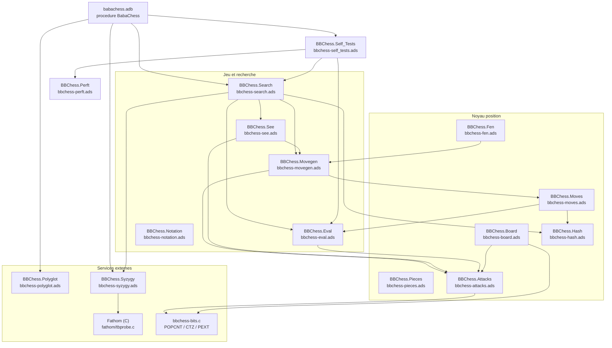
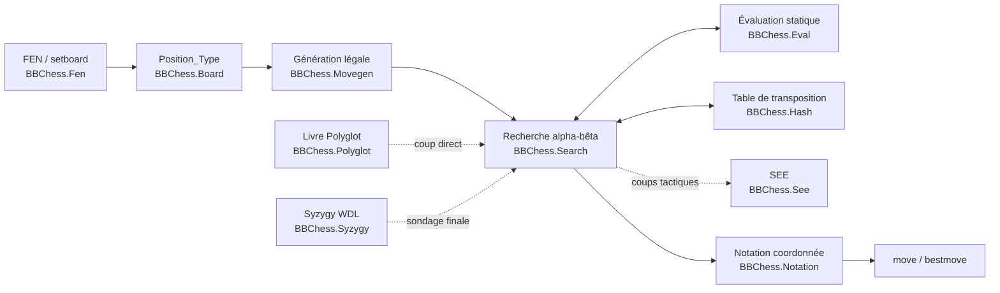

# BabaChess : documentation du moteur

BabaChess (BB) est un moteur d'échecs écrit de zéro en **Ada 2012**, à
représentation **bitboard**. Il vit dans `src/` et se construit par le projet
`babachess.gpr` vers l'exécutable `bin_bb/babachess`. Le moteur **mailbox**
d'AdaChess (dit **MB**) a été **retiré** du dépôt au moment du fork : ses
valeurs de perft servent toujours de référence de validation. La journalisation
d'ingénierie fait foi dans `DEVELOPMENT.md` (racine, en français, historique) ;
`CHANGELOG.md` couvre les versions du moteur.

> **Développement assisté par IA.** Toutes les modifications apportées au projet
> depuis le fork initial (moteur, scripts, tests et documentation
> incluse) ont été réalisées **avec l'aide d'agents IA** ; **aucun développement
> n'a été fait manuellement**. Modèle principal : **DeepSeek V4.1 Flash** ;
> corrections et compléments apportés par des **prompts générés avec Claude** et
> **Kimi K3**. Outils de travail de base : **opencode** (agent *Sisyphus* /
> OhMyOpenCode) et des **interfaces web**.

BB parle **XBoard/Winboard et UCI** (le protocole est choisi par la commande
`uci`). Il gère une horloge `level`/`time`/`otim`, un livre d'ouvertures
**Polyglot**, des tablebases **Syzygy** (via Fathom vendorisé) et le
multi-thread **Lazy SMP**.

## Principes d'architecture

Le cœur du moteur est un **noyau fonctionnel sans état global** : les paquets
`BBChess.*` manipulent une valeur `Position_Type` passée en paramètre, jamais une
variable cachée. Seuls le contexte de recherche et les tables précalculées
portent de l'état, et celui-ci est explicitement réinitialisé (`Reset_Search`).

- **Représentation** : 12 bitboards (un par pièce) plus les occupations
  couleur/totale, maintenues de façon incrémentale par `Put_Piece` /
  `Remove_Piece`. Convention `BBChess.Board` : case = `rank * 8 + file`, a1 = bit 0,
  h8 = bit 63.
- **Attaques** : tableaux précalculés pour les sauteurs (cavalier, roi, pions) et
  recherche indexée par masque d'occupation pour les pièces glissantes
  (PEXT/BMI2, avec repli logiciel en mode `portable`). Les opérations de bits
  matérielles sont dans le shim C `bbchess-bits.c`.
- **Coups** : un `Move_Type` compact (départ, arrivée, pièce, promotion, drapeau)
  et un couple `Make_Move` / `Unmake_Move` en **snapshot + `Undo_Info`**, ce qui
  rend la position copiable et simplifie perft, recherche et FEN.
- **Movegen** : stratégie « correction d'abord » : génération pseudo-légale,
  puis filtre de légalité (masque d'épingles quand on n'est pas en échec). Le
  générateur tactique séparé alimente la quiescence.
- **Recherche** : itération progressive avec table de transposition, PVS,
  ordonnancement (coup de hash, MVV-LVA, killers, historique), LMR, null-move,
  futility inverse, extension d'échec et quiescence (SEE). La recherche temporisée
  est interruptible.
- **Évaluation** : matériel + PST interpolés par la phase, complétés par mobilité,
  paire de fous, structure de pions, tours et sécurité du roi. `Static` est
  symétrique ; `Evaluate` ajoute un bonus de tempo pour le trait.

### Architecture des paquets



### Flux de données

Le chargement d'une position passe toujours par une valeur `Position_Type`.
`BBChess.Fen` l'initialise, `BBChess.Movegen` la lit pour produire les coups,
`BBChess.Search` la fait évoluer par `Make_Move`/`Unmake_Move` et interroge
`BBChess.Eval`. La table de transposition, le livre Polyglot et les tablebases
Syzygy sont des **composants latéraux** consultés pendant la recherche, jamais
des propriétaires de la position.



## Interface en ligne de commande

| Mode | Effet |
|---|---|
| `--selftest` | Exécute la suite interne (`BBChess.Self_Tests`) : perft 1-5, Zobrist, coups empaquetés, validation FEN, recherche, répétition, SEE, clé de Polyglot. Sortie 0. |
| `--bench [profondeur]` | Cherche 8 positions fixes à profondeur donnée (défaut 8) et rapporte nœuds, temps et knps. |
| `--threads N` | Nombre de threads de recherche Lazy SMP (1 à 16). La table de transposition est partagée, les heuristiques sont par thread. Formes équivalentes : `-TN` et `--thread=N`. |
| `--book <fichier>` | Ouvre un livre d'ouvertures Polyglot `.bin`. Sans option, BB tente des emplacements conventionnels (`books/book.bin`, dossier de l'exécutable, `~/.babachess/book.bin`). |
| `--syzygy <dossier>` | Initialise les tablebases Syzygy via `BBChess.Syzygy.Init`. Inerte sans fichiers `.rtbw`/`.rtbz`. |
| `--dump-params` | Affiche les paramètres scalaires de l'évaluation (`BBChess.Eval.Dump_Params`). |
| `--eval-fens <fichier>` | Lit un FEN par ligne (`FEN` ou `FEN;resultat`) et imprime l'évaluation statique blanche-positive, un entier par ligne. |
| `--params <fichier>` | Charge un fichier de paramètres d'évaluation ; s'applique à **tous** les modes. |

`--params` s'applique à tous les modes. `--threads` ne concerne que la recherche
temporisée des modes de jeu : `--selftest` et `--bench` l'ignorent. Les options
`--book` et `--syzygy` sont lues avant la sélection du mode, donc elles ouvrent
bien le fichier demandé ; en revanche `--selftest`, `--bench` et `--eval-fens`
retournent avant le chargement automatique du livre par défaut et ne sondent
jamais livre ni tablebases.

En mode UCI, les mêmes fonctions sont exposées par `setoption` (`Hash`, `Threads`,
`OwnBook`, `BookFile`, `SyzygyPath`) et par `go` (`wtime`, `btime`, `winc`,
`binc`, `movetime`, `depth`, `nodes`, `infinite`). La recherche UCI est
**asynchrone** (Phase 5) : le `go` s'exécute dans une tâche, donc `isready`
répond `readyok` pendant la recherche, `stop` l'interrompt (le coup courant est
rendu immédiatement) et `quit` arrête la recherche puis sort. `go nodes N`
s'arrête au plafond de nœuds et `go infinite` ne s'arrête que sur `stop` (ou
`quit`). La recherche XBoard reste, elle, synchrone.

## Construction

```bash
gprbuild -P babachess.gpr -XMode=release    # -> bin_bb/babachess (POPCNT/BMI2)
gprbuild -P babachess.gpr -XMode=portable   # -> bin_bb/babachess (repli logiciel)
gprbuild -P babachess.gpr -XMode=debug      # -> bin_bb/babachess (assertions)
```

`release` (défaut) compile avec `-mpopcnt -mbmi -mbmi2` et emploie `_pext_u64`
pour les attaques glissantes : il exige un processeur compatible BMI2. `portable`
retire ces commutateurs et utilise le repli logiciel de `bbchess-bits.c`
(environ 25 % plus lent, mais tourne sur tout x86-64). Les deux modes partagent
`obj_bb/` : après une construction `portable`, ne comparez pas `--bench` avec un
binaire `release` sans `rm -rf obj_bb`.

## Index de la documentation

- [bitboards.md](bitboards.md) : représentation du plateau, pièces, attaques,
  hachage Zobrist et lecture FEN (`BBChess.Board`, `BBChess.Pieces`,
  `BBChess.Attacks`, `BBChess.Hash`, `BBChess.Fen`).
- [evaluation.md](evaluation.md) : évaluation statique, phase, termes
  positionnels et paramètres ajustables (`BBChess.Eval`).
- [recherche.md](recherche.md) : génération de coups, make/unmake, SEE,
  alpha-bêta, table de transposition et Lazy SMP (`BBChess.Movegen`,
  `BBChess.Moves`, `BBChess.See`, `BBChess.Search`).
- [finales.md](finales.md) : tablebases Syzygy via Fathom, sondage WDL
  (`BBChess.Syzygy`, `src/fathom/`).
- [ouvertures.md](ouvertures.md) : livre d'ouvertures Polyglot, clé compatible
  et sondage pondéré (`BBChess.Polyglot`).
- [outils-et-tests.md](outils-et-tests.md) : `--selftest`, perft, `--bench`,
  `--eval-fens`, `--params`, scripts de mesure et SPRT.
- [build-and-cpu.md](build-and-cpu.md) : modes de construction (`release`,
  `portable`, `debug`), commutateurs GNAT/C exacts, alias `-T#`/`--thread=#` et
  historique des optimisations CPU.
- `CHANGELOG_TECHNIQUE.md` (racine) : chantier solidité / propreté / performance
  (P0-P7) — nettoyage C, invariant `Squares`, avertissements, `Piece_Values`,
  SEE itérative, factorisation, `Cont_History` 16 bits.

## Références

- Chess Programming Wiki : <https://www.chessprogramming.org/Main_Page>
- Universal Chess Interface : <https://www.chessprogramming.org/Universal_Chess_Interface>
- XBoard / Winboard protocol : <https://www.chessprogramming.org/XBoard>
- Lazy SMP : <https://www.chessprogramming.org/Lazy_SMP>
- Forum TalkChess : <https://talkchess.com>

Le journal de développement détaillé (choix, mesures, résultats négatifs)
reste `DEVELOPMENT.md` à la racine du dépôt.
