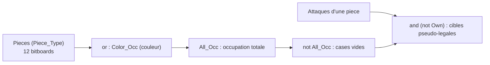
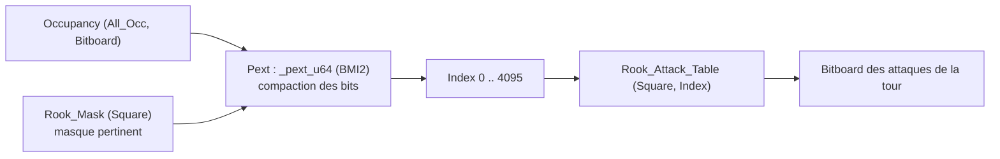
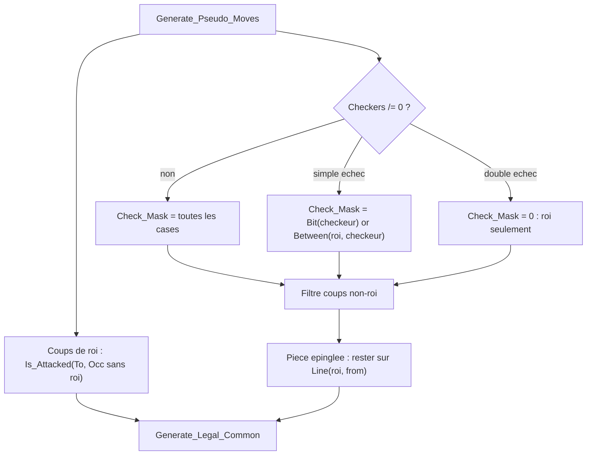

# Bitboards et génération d'attaques

Ce document décrit la représentation bitboard d'BabaChess et les principes
de génération des attaques. Il complète le journal d'ingénierie
(`DEVELOPMENT.md`, sections 2, 7septies et 16). Tout le code cité vit dans
`src/`, packages `BBChess.*`.

## 1. Le type Bitboard

Le cœur de la représentation tient dans deux déclarations de
`bbchess-board.ads` : `subtype Square_Type is Natural range 0 .. 63;` et
`type Bitboard is mod 2 ** 64;`.

`Bitboard` est un **type modulaire** de 64 bits : chaque bit représente une
case. Les opérations d'ensemble se font donc directement avec les opérateurs
du langage, sans appel de fonction : `or` (union), `and` (intersection),
`not` (complément), `and not` (différence). Soit 64 cases traitées d'un coup.

### Mapping des cases

L'index d'une case est `Rank * 8 + File`, avec la convention suivante
(documentée en tête de `bbchess-board.ads`) :

- `File 0` = colonne A, `Rank 0` = rangée 1 (la rangée de base des Blancs).
- `bit 0` = **a1**, `bit 63` = **h8**.
- Augmenter l'index va vers le nord : `+8` par rang, `+1` par colonne.

```ada
function File_Of (Square : in Square_Type) return Natural is (Square mod 8);
function Rank_Of (Square : in Square_Type) return Natural is (Square / 8);
```

Cette convention (a1 en LSB) est le miroir exact du mapping mailbox de MB
(`a8 = 21 ... h1 = 98`, `DEVELOPMENT.md` §3). Le corps de `BBChess.Board`
précalcule par ailleurs une table `Bit : array (Square_Type) of Bitboard` où
`Bit (Square) := 2 ** Square` : ce masque à un seul bit sert partout
(insertion, retrait, tests d'appartenance).

## 2. Position : bitboards de pièces et occupation

Une `Position_Type` ne stocke pas une pièce par case, mais **douze
bitboards**, un par pièce concrète, plus les occupations :

```ada
type Piece_Board_Array is array (Piece_Type) of Bitboard;
type Color_Board_Array is array (Color_Type) of Bitboard;

type Position_Type is record
   Pieces    : Piece_Board_Array := (others => 0);
   All_Occ   : Bitboard := 0;
   Color_Occ : Color_Board_Array := (others => 0);
   Side      : Color_Type := White;
   -- ... roque, en passant, compteurs, Zobrist, matériel
end record;
```

`Piece_Type` (dans `bbchess-pieces.ads`) est ordonné pour que chaque couleur
occupe un bloc contigu de six valeurs, `White_Pawn .. White_King` puis
`Black_Pawn .. Black_King` ; les fonctions `Color`, `Kind` et `Make` le
décomposent et le recomposent par arithmétique modulaire.

`All_Occ` et `Color_Occ` ne sont **pas** recalculés par balayage : `Put_Piece`
les met à jour de façon incrémentale avec
`Position.All_Occ := Position.All_Occ or Bit (Square)`, tandis que
`Remove_Piece` retire le bit avec `and (not ...)`. Toute mutation passant par
ces deux procédures, les occupations restent cohérentes.

## 3. Opérations setwise de base

Trois primitives parcourent un bitboard sans boucler sur les 64 cases :
`Lowest_Bit (Board)` (index du bit de poids faible, prérequis `Board /= 0`),
`Popcount (Board)` (nombre de bits) et `Clear_Lowest_Bit (Board : in out
Bitboard)`. Les deux premières sont importées du shim C `bbchess-bits.c`
(`__builtin_ctzll`, `__builtin_popcountll`), exposées via `C_Ctz` et
`C_Popcount`. La troisième se passe d'intrinsèque : `Board and (Board - 1)`
efface le bit de poids faible. D'où le motif d'itération de la génération de
coups : `while Set /= 0 loop Sq := Lowest_Bit (Set); ...; Set := Set and (Set - 1); end loop;`.



## 4. Attaques des sauteurs : tables précalculées

Cavalier, roi et pions sont des **sauteurs** : leurs attaques ne dépendent
pas de l'occupation. Les ensembles sont précalculés une fois pour toutes à
l'élaboration, dans `bbchess-attacks.ads`. Les tables sont **privées** ; elles
sont lues par des accesseurs `Inline` portant le même nom (`Knight_Attacks (S)`,
etc.), ce qui empêche tout module extérieur de les corrompre après `Init` tout
en gardant un coût nul à `-O3` (les accesseurs sont entièrement inlinés) :

```ada
function Knight_Attacks (Square : in Square_Type) return Bitboard with Inline;
function King_Attacks   (Square : in Square_Type) return Bitboard with Inline;
function Pawn_Attacks   (Color : in Color_Type; Square : in Square_Type)
  return Bitboard with Inline;
```

Le corps de `BBChess.Attacks` part de tableaux de deltas `(DF, DR)` :
`Knight_Deltas` (les huit sauts) et `King_Deltas` (les huit directions). Les
attaques de pions sont construites à part, car un pion blanc attaque en
montant (`R + 1`) et un pion noir en descendant (`R - 1`). `Build_Leaper`
applique chaque delta, vérifie `In_Board (F, R)` et pose
`Bit (Square_Of (F, R))`.

Le résultat est une attaque **sans occupation** : pour un cavalier ou un roi,
on intersecte ensuite avec `not Own` (et éventuellement `Enemy`) pour obtenir
les cibles. Pour les pions, la relation est utilisée à l'envers : un pion
blanc attaquant une case se trouve sur une case qu'un pion noir placé là
attaquerait (voir `Is_Attacked`).

## 5. Attaques glissantes : lookup PEXT

Fous, tours et dames voient leurs attaques **dépendre de l'occupation** : un
bloqueur arrête le rayon. La solution retenue est un indexage par `PEXT`
(BMI2), décrite dans `DEVELOPMENT.md` §7septies. Elle a remplacé les magic
bitboards, avec un gain notable : le démarrage passe d'environ 1,9 s à
environ 0,03 s, car il n'y a **plus de recherche de magics** à l'exécution.

### Principe

Pour chaque case et chaque type de glisseur, `Slider_Mask` construit un
**masque d'occupation pertinent** : toutes les cases atteignables sur les
rayons, sauf les cases terminales de bord (elles n'influencent jamais
l'arrêt du rayon). Tailles d'index : tour jusqu'à 12 bits pertinents
(`Max_Rook_Index = 4095`), fou jusqu'à 9 (`Max_Bishop_Index = 511`).

`PEXT` extrait les bits d'occupation tombant dans le masque et les compacte
en un entier. C'est une **bijection** entre les sous-ensembles du masque et
les index `0 .. 2^n - 1` : aucune collision, donc aucun magic à chercher. On
indexe directement la table :

```ada
function Rook_Attacks (Square : in Square_Type; Occupancy : in Bitboard)
  return Bitboard is
begin
   return Rook_Attack_Table
     (Square, Natural (Pext (Occupancy, Rook_Mask (Square))));
end Rook_Attacks;
```

`Queen_Attacks` n'a pas de table propre : c'est
`Rook_Attacks (Square, Occupancy) or Bishop_Attacks (Square, Occupancy)`.



### Construction des tables

`Build_Rook_Table` et `Build_Bishop_Table` remplissent leurs tables pour
chaque case en parcourant les sous-ensembles du masque. Le motif
`Sub := (Sub - 1) and Mask` les énumère de façon strictement décroissante, et
chaque sous-ensemble est rangé à `Pext (Sub, Mask)`.

`Sliding_Attacks` est la version naïve, utilisée **uniquement à la
construction** : elle avance rayon par rayon et s'arrête à la première case
occupée (le bloqueur fait partie des attaques). À l'exécution, plus personne
ne parcourt les rayons : un `PEXT` suivi d'un accès mémoire suffit.

### Tables `Between` et `Line`

Le même mécanisme précalcule deux tables carrées pour la détection d'échec
et les épingles : `Between (A, B)` (cases strictement entre A et B, vide si
non alignées) et `Line (A, B)` (ligne complète passant par A et B,
extrémités incluses). Elles se calculent depuis les attaques glissantes sur
plateau vide, par exemple
`Between (A, B) := Rook_Attacks (A, Bit (B)) and Rook_Attacks (B, Bit (A))`.

## 6. La génération de coups

`BBChess.Movegen` exploite ces tables. `Generate_Pseudo_Moves` produit des
coups pseudo-légaux, puis `Generate_Legal_Common` filtre la légalité.

### Pions : génération par décalages massifs

Les poussées et captures de pions sont calculées pour **tous les pions à la
fois**, par décalage de bitboard. Comme le mapping met le rang dans les bits
de poids fort, avancer d'un rang revient à multiplier ou diviser par 256.
Par exemple pour les Blancs :

```ada
Push1 := (Pawns * 256) and Empty;                        -- poussée simple
Dbl   := ((Push1 and White_Push_Rank) * 256) and Empty;  -- poussée double
Caps_L := ((Pawns and not File_A_BB) * 128) and Enemy;   -- capture diagonale gauche
Caps_R := ((Pawns and not File_H_BB) * 512) and Enemy;   -- capture diagonale droite
```

Les versions noires divisent par 256 et 512/128. `File_A_BB` et `File_H_BB`
sont des masques de colonne précalculés dans `BBChess.Attacks` : ils évitent
les captures qui « enrouleraient » d'un bord à l'autre. Les promotions
sortent par `Emit_Promotions` (dame, tour, fou, cavalier).

Pour les autres pièces, on itère leurs bits puis on retire les cases amies :
`Targets := Bishop_Attacks (From, Occ) and not Own;`, et de même
`King_Attacks (From) and not Own` pour le roi. Le roque est ajouté à part,
après vérification que les cases intermédiaires sont libres et non attaquées.

### Filtre de légalité

`Generate_Legal_Common` évite un make/unmake systématique :

1. `Attackers_To` énumère les pièces adverses attaquant le roi, ce qui donne
   le bitboard `Checkers`.
2. En **échec simple**, `Check_Mask` vaut le bit du donneur plus
   `Between (roi, donneur)` : il faut capturer ou s'interposer. En **échec
   double**, `Check_Mask = 0`, seul le roi peut bouger.
3. `Pin_Mask` calcule les pièces **absolument épinglées** à partir des rayons
   du roi : une pièce est épinglée quand elle est l'unique bloqueur entre son
   roi et un glisseur ennemi de direction compatible.
4. Un coup non-roi n'est retenu que s'il tombe dans `Check_Mask` et, si la
   pièce est épinglée, s'il reste sur `Line (roi, from)`.
5. Le roi ne peut pas aller sur une case attaquée. Le test se fait en
   retirant le roi de l'occupation (`Occ_No_King`), pour compter les attaques
   découvertes.
6. La **prise en passant** passe par un make/unmake complet, car elle peut
   découvrir une attaque sur la rangée.



## 7. Validation par perft

`BBChess.Perft` est l'oracle de correction. La fonction récursive `Nodes`
compte les feuilles d'un arbre de coups légaux : profondeur 0 renvoie 1,
profondeur 1 renvoie directement `Count`, sinon elle énumère les coups, fait
`Make_Move`, descend en `Depth - 1`, puis `Unmake_Move`.

Perft exerce exactement les briques décrites ici : tables d'attaques, filtre
de légalité, make/unmake. Si un rayon glissant saute un bloqueur, si un
masque de colonne est faux ou si une épingle est oubliée, le compte dévie.
`--selftest` compare les valeurs attendues à celles du moteur :

| Position | Profondeur | Attendu |
|---|---|---|
| Initiale | 1 à 5 | 20, 400, 8 902, 197 281, 4 865 609 |
| Roque | 1 à 3 | 48, 2 039, 97 862 |
| En passant | 1 à 3 | 14, 191, 2 812 |
| Promotions | 1 à 2 | 44, 1 486 |

Le perft est aussi recoupé avec MB, le moteur mailbox du dépôt, oracle
indépendant (`DEVELOPMENT.md` §2 et §4). Règle d'or du projet : **tout
changement de movegen, recherche ou évaluation doit garder `--selftest` vert
et les comptes de perft inchangés.**

## 8. Les deux modes de compilation

**`release`** compile Ada et C avec `-O3 -mpopcnt -mbmi -mbmi2`. `Pext`,
importée de C, se résout en l'instruction matérielle `_pext_u64` (le shim est
compilé avec `__BMI2__` défini), et `Popcount` / `Lowest_Bit` utilisent POPCNT
et TZCNT. Ce binaire **exige un CPU avec BMI2/POPCNT** : sur un processeur
plus ancien il s'arrêterait sur une instruction illégale.

**`portable`** conserve `-O3 -gnatN` mais **retire** `-mpopcnt -mbmi -mbmi2`
côté Ada comme côté C. `__BMI2__` n'étant plus défini, `baba_pext` bascule sur
une boucle logicielle qui parcourt les bits du masque et reconstruit le
résultat bit à bit ; `__builtin_popcountll` et `__builtin_ctzll` se rabattent
sur les routines libgcc. Le binaire tourne alors sur n'importe quel x86-64.

### Pourquoi les deux modes sont identiques

Un **seul fichier** `bbchess-bits.c` sert les deux modes : la seule
différence est la macro `__BMI2__`, donc la sémantique de `baba_pext` reste la
même (même bijection, même index). Les tables construites à l'élaboration
sont bit pour bit identiques, et la génération de coups ne connaît pas le
mode de compilation.

C'est mesuré dans `DEVELOPMENT.md` §16 : `--bench 9` donne **le même arbre**
(780 851 nœuds) dans les deux modes, seul le débit change (environ
1,46 M knps en `release` contre 1,07 M en `portable`, environ 27 % plus
lent). `--selftest` reste vert, perft 1 à 5 inchangé. Attention : les deux
modes partagent `obj/`, donc ne pas mélanger les builds dans un même
arbre.

## Références

- [Bitboards, Chess Programming Wiki](https://www.chessprogramming.org/Bitboards)
- [General Setwise Operations, Chess Programming Wiki](https://www.chessprogramming.org/General_Setwise_Operations)
- [Sliding Piece Attacks, Chess Programming Wiki](https://www.chessprogramming.org/Sliding_Piece_Attacks)
- [Magic Bitboards, Chess Programming Wiki](https://www.chessprogramming.org/Magic_Bitboards)
- [Bit Scanning, Chess Programming Wiki](https://www.chessprogramming.org/Bit_Scanning)
- [Perft, Chess Programming Wiki](https://www.chessprogramming.org/Perft)
