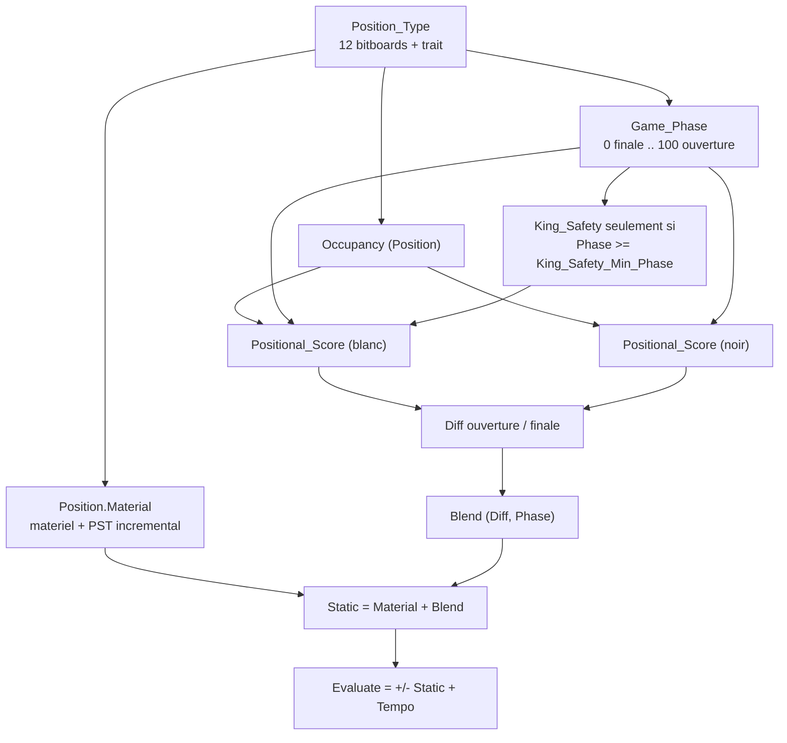
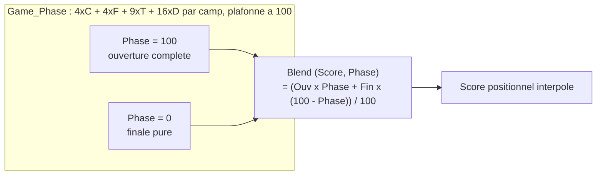

# Évaluation statique d'BabaChess

L'évaluation vit dans `BBChess.Eval` (`src/bbchess-eval.ads` / `.adb`). Elle
produit un score en **centipawns**, positif quand les Blancs sont mieux. Le
negamax interroge `Static (Position)`, le cœur sans tempo strictement
antisymétrique, et `Evaluate (Position)`, `Static` ramené du point de vue du
trait plus le bonus de tempo. `Infinity` et `Mate_Score` valent `30_000`. Le
package n'a aucune branche dédiée « Blanc » ou « Noir » : c'est la clé de la
symétrie (voir plus bas).

## 1. Vue d'ensemble du pipeline



Le déroulé de `Static` est linéaire : `Result := Position.Material` (total
matériel + PST **incrémental**, tenu par `Make_Move` / `Unmake_Move`),
`Game_Phase` et `Occupancy` calculés une seule fois puis partagés,
`Positional_Score` appelé pour White et Black, les deux vecteurs **soustraits**
terme à terme, enfin `Blend`. `Evaluate` oriente `Static` vers le trait et
ajoute `Tempo`.

## 2. Matériel et tables pièce-case (PST)

Les valeurs matérielles viennent de `Params` via `Piece_Value` : `P_Pawn` 100,
`P_Knight` 320, `P_Bishop` 330, `P_Rook` 500, `P_Queen` 900, roi 0.

Chaque pièce a une table `PST_Table` de 8×8 : `Pawn_PST`, `Knight_PST`,
`Bishop_PST`, `Rook_PST`, `Queen_PST`, `King_PST`. `PST` lit la table dans le
repère de la couleur : une pièce blanche utilise `Rank_Of (Square)`, une noire
`7 - Rank_Of (Square)`. Les lignes vont de la rangée arrière (0) vers le camp
adverse (7), donc **une seule table sert les deux camps** sans duplication. Les
PST encodent du savoir positionnel : cavalier pénalisé sur les bords, fou attiré
par les grandes diagonales, tour sur la 7ᵉ, `King_PST` qui garde le roi au roque
et `King_End_PST` qui le centralise en finale.

Pour raccourcir la boucle matérielle la plus chaude, `Rebuild_Material_PST`
précalcule à l'élaboration `Material_PST (Piece, Square) = Piece_Value + PST`.
`Material_PST_Value` alimente `Make_Move`, `Compute_Material` refait le total
complet (init après `Load`, contrôle self-test), et `Set_Param` reconstruit la
table plate si la valeur modifiée est matérielle.

## 3. Évaluation « tapered » (interpolation ouverture / finale)

Chaque terme positionnel n'est pas une constante unique : il est évalué **deux
fois**, pour l'ouverture et pour la finale, puis interpolé. Le type
`Tapered_Score_Type` porte la paire `Opening` / `End_Game` ; `Both`, l'opérateur
`"+"` et `Blend` composent ces paires :



`Game_Phase` reprend le comptage classique : 4 par cavalier, 4 par fou, 9 par
tour, 16 par dame, pour les deux camps, plafonné à 100. La position de départ
vaut 100, une finale de rois et pions vaut 0. L'intérêt du tapered : chaque
terme décrit un comportement différent selon la phase. La paire de fous vaut 20
puis 45 (`P_Bishop_Pair_Op` / `P_Bishop_Pair_Eg`) ; une tour sur la 7ᵉ passe de
15 à 35 (`P_Rook7_Op` / `P_Rook7_Eg`) ; les pions passés ont **deux tables**
dont le bonus grimpe de 5 à 130 cp avec la rangée ; le roi est corrigé en finale
par `King_End_PST (K_Row, K_File) - PST (King, ...)`, un écart nul en ouverture
devenu bonus centralisateur. `Both` duplique une même valeur dans les deux
champs (cas de la mobilité).

## 4. Termes positionnels, calculés par couleur

Le positionnel tient dans `Positional_Score`, **générique en couleur** : l'appeler
avec White puis Black et soustraire le résultat reste symétrique. Elle reçoit
`Occ` (l'occupation, calculée une fois) et renvoie deux paramètres de sortie de
danger du roi (`Near_Danger`, `Far_Danger`, `Attackers`) consommés par
`King_Safety`. Depuis P3.1, ses termes sont **six fonctions locales nommées** —
`Bishop_Pair_Term`, `Mobility_Term`, `Connected_Rooks_Term`,
`Pawn_Structure_Term`, `Pawn_Threats_Term`, `King_Activity_Term` — de sorte que
chacun soit mesurable et tunable individuellement ; leur somme reproduit
l'arithmétique d'origine (iso-comportement vérifié).

### 4.1 Paire de fous et mobilité

Si `Popcount (Pieces (Color, Bishop)) = 2`, un bonus tapered est ajouté
(`Bishop_Pair_Opening` / `Bishop_Pair_Endgame`), plus fort en finale.

Pour chaque cavalier, fou, tour et dame, `Piece_Attacks` produit les cases
atteignables selon l'occupation et on compte
`Popcount (Piece_Attacks and Free)` où `Free = not Own`. La mobilité est
**pondérée par phase** : les poids d'ouverture valent `Mobility_N` (4),
`Mobility_B` (4), `Mobility_R` (2), `Mobility_Q` (1), et les poids de finale
`Mobility_N_Eg`, `Mobility_B_Eg`, `Mobility_R_Eg`, `Mobility_Q_Eg` (défaut
**égal** aux poids d'ouverture, donc taper neutre par défaut). Cavalier et fou
sont les plus sensibles à leur liberté, la dame est peu pondérée pour ne pas
« compenser » seule une position passive.

### 4.2 Tours (7ᵉ, colonnes ouvertes, semi-ouvertes, connectées)

Toujours dans la boucle de mobilité, un traitement spécial des tours :

- **7ᵉ rangée** : si `Own_Row (Color, Sq) = 6`, bonus `Rook_On_7th_Opening` /
  `Rook_On_7th_Endgame`, plus `Rook_On_7th_King` si le roi adverse est encore
  sur ses deux rangées arrière (`Own_Row (Enemy, Enemy_King) <= 1`) ;
- **colonne ouverte** (aucun pion, ami ou ennemi) : `Rook_Open_File_Opening` /
  `Rook_Open_File_Endgame` ;
- **colonne semi-ouverte** (aucun pion ami) : `Rook_Semi_Open_Opening` /
  `Rook_Semi_Open_Endgame` ;
- **tours connectées** : si les deux tours se défendent sur une même ligne
  (`Rook_Attacks (R1, Occ) and RR` non nul), `Rook_Connected_Opening` /
  `Rook_Connected_Endgame`.

La détection passe par `File_Mask`, sans boucle par pion, et la case du roi
adverse est hissée hors de la boucle.

### 4.3 Structure de pions

Cette partie est entièrement bitboard :

- **pions doublés** : pour chaque colonne,
  `Popcount (Own_Pawns and File_Mask (F))` ; au-delà du premier pion, pénalité
  `(-Doubled_Pawn_Opening)` / `(-Doubled_Pawn_Endgame)` par pion excédentaire ;
- **pions isolés** : aucun pion ami sur les colonnes adjacentes
  (`Own_Pawns and Adj = 0`), pénalité `(-Isolated_Pawn_Opening)` /
  `(-Isolated_Pawn_Endgame)` par pion ;
- **pions passés** : détectés par `Passed_Pawns`, qui repose sur
  `Front_Blockers`. Celui-ci élargit les pions ennemis à leurs colonnes voisines
  (`East_1` / `West_1`) puis les propage rangée par rangée (`South_1` /
  `North_1`) : un pion dont l'avant est libre est passé. Sept décalages fixes,
  sans parcours par pion ;
- bonus par rangée `Passed_Pawn_Opening (Row)` / `Passed_Pawn_Endgame (Row)` ;
- **protégé** : `Defended_By_Pawn` détecte un pion ami sur les cases de défense
  arrière (`Pawn_Attacks (Opposite (Color), Square)`) et ajoute une fraction du
  bonus passé (`Protected_Passed_Opening` / `Protected_Passed_Endgame`) ;
- **éloigné** : un pion passé à `Outside_Passed_Distance` (2) colonnes ou plus
  du roi ennemi touche `Outside_Passed_Opening` / `Outside_Passed_Endgame`.

### 4.4 Activité du roi en finale

En ouverture, la contribution du roi au positionnel est nulle : `King_PST` fait
le travail. En finale, la correction interpolée vaut
`King_End_PST (K_Row, K_File) - PST (King, Color, King_Sq)`, ce qui recentre
progressivement le roi.

### 4.5 Sécurité du roi (terme sensible, gelé)

`King_Safety` n'est ajouté que si `Phase >= King_Safety_Min_Phase` (20) : c'est
un terme d'ouverture / milieu de jeu, **actuellement considéré comme sensible et
laissé gelé**. La version en place calcule :

- deux zones précalculées autour du roi : `Near_Zone` (distance 1, case du roi
  incluse pour qu'un échec compte) et `Far_Zone` (distance 2, demi-poids) ;
- un danger **non linéaire** `- (Near_Danger * (Attackers + 1)) / 2 - Far_Danger`,
  `Near_Danger` additionnant `P_Atk_N` (10), `P_Atk_B` (10), `P_Atk_R` (16),
  `P_Atk_Q` (24) : une attaque coordonnée pèse plus que la somme des attaquants ;
- `P_Exposed` (28) si le roi a quitté sa rangée arrière ;
- un **bouclier de pions** sur l'aile du roi (colonnes 0..2 ou 5..7) :
  `P_Shield1` / `P_Shield2` / `P_Shield3` selon la rangée du pion le plus
  avancé, ou `P_OpenFile` si la colonne est vide ;
- un **pion-storm** : `P_Storm` par pion ennemi avancé (rangées 3..5) sur
  l'aile du roi.

Un roi central ne reçoit ni bouclier ni storm : il est déjà puni par le PST de
milieu de partie. Pourquoi « gelé » : deux refontes ont été essayées puis
**revertées** (`DEVELOPMENT.md` § 17). La version « forte » (zone 5×5, unités
d'attaque pondérées, danger quadratique) et la version « chirurgicale » (zone
lointaine ÷2, quadratique plafonné) corrigeaient bien le blunder ciblé mais
régressaient en force : la chirurgicale a perdu **161-80-59 (≈ 96 Elo)** en SPRT
300 parties, une régression confirmée. La leçon consignée : un bon terme de
sécurité du roi demande un **modèle plus fin** (attaquants réellement actifs,
phases, lignes ouvertes) **et un tuning automatique**, pas un patch de
constantes. Tant que ce modèle n'existe pas, la forme actuelle est conservée.

### 4.6 Menaces (threats)

Le terme `threats`, dans `Positional_Score`, se calcule par couleur (donc
symétrique) et couvre deux cas : chaque pièce ennemie non-pion attaquée par un
pion ami rapporte `P_Threat_Pawn * Piece_Value (Kind (Pc)) / 100` ; un cavalier
ou un fou attaquant une tour ou une dame ennemie rapporte
`P_Threat_Minor * Piece_Value (Kind (Pc)) / 100`. Les deux paramètres sont dans
`Params`. `DEVELOPMENT.md` § 9.4 note que le gain mesuré contre GNU (≈ 1,5/30
avant, ≈ 3,5/30 après) reste **dans le bruit** à cette taille d'échantillon : la
recherche temporisée, non déterministe, rend les petits écarts inmesurables sans
un vrai SPRT de plusieurs centaines de parties. Le terme est conservé, avec
cette réserve documentée.

## 5. Tempo

`Tempo` vaut 10 cp ; `Evaluate` l'ajoute toujours au camp au trait :

```ada
if Position.Side = White then
   return Static (Position) + Tempo;
else
   return -Static (Position) + Tempo;
end if;
```

Ce bonus évite certains artefacts de zugzwang. Il brise volontairement
l'antisymétrie exacte d'`Evaluate`, d'où le point suivant.

## 6. Propriété de symétrie et vérification

L'évaluation doit être **symétrique** : renverser le plateau (miroir de rangée)
en échangeant les couleurs doit changer le signe du score, garantie qu'aucun
camp n'est favorisé par une asymétrie de code. Trois règles de conception y
veillent : les PST lisent la rangée dans le repère de la couleur (`Rank_Of` ou
`7 - Rank_Of`), donc une même table sert les deux camps ; `Positional_Score` est
générique en couleur et les deux vecteurs `Tapered_Score_Type` sont
**soustraits** avant `Blend` ; `Static` n'ajoute rien qui dépende du trait.
Comme `Evaluate` ajoute `Tempo`, la symétrie exacte porte sur **`Static`** :
`Static (M) = -Static (P)` quand `M` est le miroir de `P`. Invariants du
self-test :

```
Static (Start_Position) = 0
Evaluate (Start_Position) = Tempo   (Blanc au trait)
Static (miroir) = -Static (original)
```

`bbchess-self_tests.adb` implémente `Check_Symmetry (Fen)` : recharge la
position, construit son miroir (parcours des bitboards, `Flip_Rank` +
`Opposite (Color)`), recalcule `Compute_Material` sur le miroir, puis
`Assert (Static (M) = -Static (P))`. Trois FEN exercent des termes différents :
`4k3/8/8/8/8/8/4P3/4K3 w - - 0 1` (pion passé, rois) ;
`r1bq1rk1/pp3ppp/2n1pn2/2pp4/3P1B2/2NBPN2/PPPQ1PPP/2KR3R w - - 0 1` (mobilité,
paire de fous, colonnes) ; et `4k3/6R1/8/8/8/8/6r1/4K3 w - - 0 1` (tours, 7ᵉ,
tour contre tour). Toute nouvelle évaluation doit rester symétrique : c'est la
règle d'or (`DEVELOPMENT.md` § 8). Le self-test vérifie aussi la cohérence de
`Position.Material` (incrémental) avec `Compute_Material`.

## 7. Paramètres tunables et outillage

Toutes les constantes scalaires de l'évaluation sont regroupées dans le tableau
`Params` de type `Param_Array`. Les constantes nommées du code
(`Bishop_Pair_Opening`, `Mobility_N`, `Rook_On_7th_Opening`, `Pawn_Shield_Row1`,
`King_Attack_Queen`, `Threat_Pawn`, etc.) sont des `renames` sur `Params`, donc
le reste de l'évaluation ne change pas. `bbchess-eval.ads` expose
`Set_Param (Name, Value)` (ex. `"P_Mobility_N 5"`, reconstruit `Material_PST`
si la valeur est matérielle), `Load_Params (File_Name)` et `Dump_Params`.

Côté ligne de commande : `--dump-params` imprime la table, `--params <fichier>`
charge un jeu avant tout mode sans rebuild, et `--eval-fens <fichier>` sort
l'évaluation statique blanche de chaque FEN pour alimenter un tuner.

Les 44 identifiants de `Param_Id` couvrent le matériel, la paire de fous, la
mobilité (poids d'ouverture et de finale, `P_Mobility_*` / `P_Mobility_*_Eg`),
les tours (7ᵉ, colonnes, connectées), la structure de pions, la sécurité du roi
et les menaces. Les bonus passés protégés ont leurs propres identifiants
(`P_Protected_Op` / `P_Protected_Eg`, alias `Protected_Passed_Opening` /
`Endgame`) qui pondèrent le bonus passé dans `Positional_Score`.

## 8. Choix de conception et résultats négatifs assumés

Plusieurs décisions sont **délibérées** :

- **Valeurs par défaut conservées malgré le tuning Texel.** `DEVELOPMENT.md`
  § 7sexies : sur 240 parties d'auto-jeu (5 801 positions), `scripts/tune.py`
  (descente de coordonnées type Texel, `sigmoid (K * eval / 400)`, `K = 1.13`)
  baisse l'objectif (train 0,1025 → 0,0950 ; validation 0,1033 → 0,0951) mais le
  jeu obtenu **régresse d'environ 147 Elo** en A/B contre les défauts. § 21 :
  sur le dataset Lichess CC0 (100 000 positions humaines), la MSE baisse encore
  (train 0,2173 → 0,2141) mais le jeu de 30 paramètres perd **≈ 38 Elo** en SPRT
  300 parties (117-84-99, LOS 99 %). Conclusion : la MSE reste **déconnectée de
  la force de jeu** ; les défauts sont gardés volontairement.
- **SPSA comme piste restante.** `scripts/spsa.py` compare deux jeux de
  paramètres avec le **même binaire** via des wrappers `--params`, perturbe
  35 paramètres (hors matériel) et optimise le résultat réel des parties. Tout
  jeu gagnant devra passer un SPRT de 300 parties avant adoption.
- **Tempo asymétrique assumé.** C'est un choix ; la symétrie est garantie sur
  `Static`.
- **Sécurité du roi gelée.** Le terme a apporté un gain en blitz (§ 7bis) mais
  deux extensions plus ambitieuses ont régressé en SPRT (§ 17) et sont
  revertées : le modèle actuel est stable, pas optimal.
- **Phase non incrémentale.** Une phase maintenue par `Make`/`Unmake` a été
  implémentée puis revertée (§ 12) : les 8 `Popcount` de `Game_Phase` pèsent
  ~0,2 % du temps et le champ ajouté alourdissait les copies de `Position`.

En résumé, l'évaluation de BB est volontairement **simple, sûre et symétrique** :
matériel + PST interpolés par phase, plus des termes positionnels classiques
calculés en bitboard. Les tentatives d'enrichissement qui n'ont pas passé le
SPRT ont été retirées ou gelées.

## Références

- [Evaluation](https://www.chessprogramming.org/Evaluation)
- [Piece-Square Tables](https://www.chessprogramming.org/Piece-Square_Tables)
- [Tapered Eval](https://www.chessprogramming.org/Tapered_Eval)
- [Mobility](https://www.chessprogramming.org/Mobility)
- [Pawn Structure](https://www.chessprogramming.org/Pawn_Structure)
- [King Safety](https://www.chessprogramming.org/King_Safety)
- [Automated Tuning](https://www.chessprogramming.org/Automated_Tuning)
