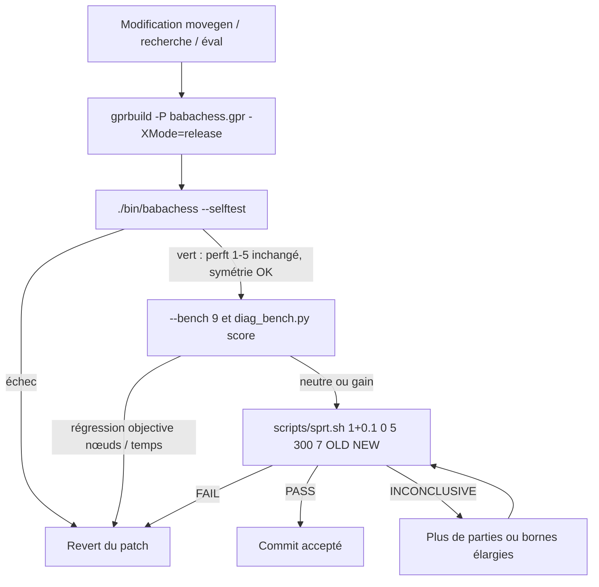
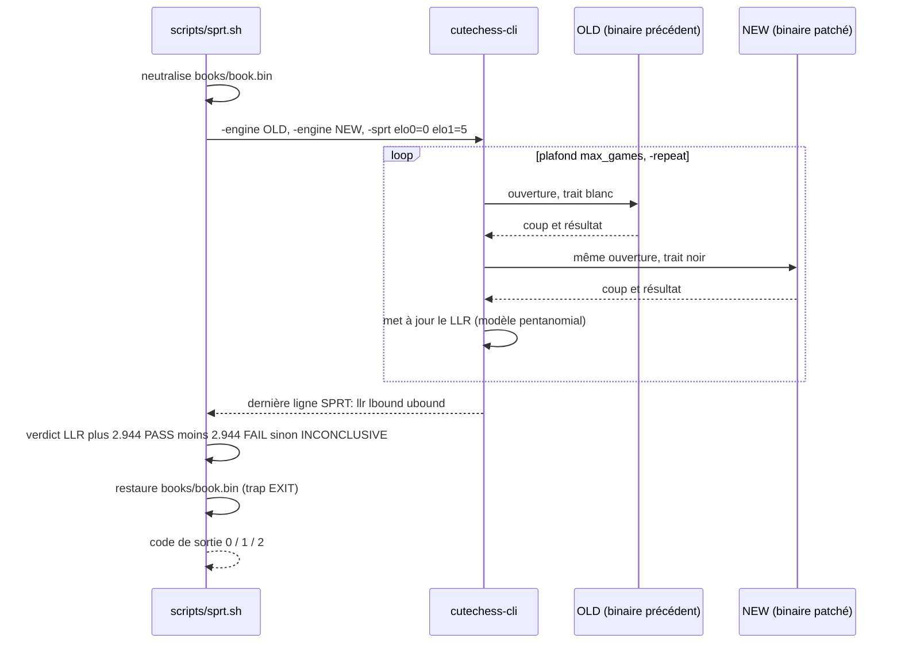
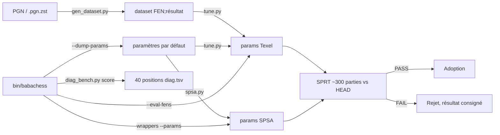

# Outils et tests : garder le moteur honnête

BabaChess n'a ni cadre de tests ni intégration continue. La vérité d'une
modification se mesure avec trois instruments : `--selftest` (correction),
`--bench` (coût machine) et le SPRT (force réelle). Ce document explique comment
ils s'articulent et quelles règles empêchent de se raconter des histoires.

## Le principe : corriger d'abord, décider ensuite

Un patch peut être rapide, élégant et faux. L'ordre d'évaluation est donc figé :

1. **Correction** : `--selftest` doit passer et les perft ne doivent **jamais**
   régresser. Aucune exception.
2. **Coût** : `--bench` et le banc diagnostique vérifient que le patch n'échange
   pas une régression de force contre une hausse de nœuds.
3. **Force** : `scripts/sprt.sh` est le seul juge d'une amélioration de jeu.

Une modification ne saute jamais l'étape 1, et aucune conclusion de force ne se
prend sur un match court.



## `--selftest` : la suite interne

```bash
./bin/babachess --selftest    # sortie 0 si tout passe
```

Le mode retourne avant le chargement automatique des services orchestré par
`babachess.adb` : il n'ouvre ni livre par défaut ni tablebases (une option
`--book` / `--syzygy` explicite, lue plus tôt, ouvrirait en revanche le fichier
demandé). `BBChess.Self_Tests.Run` (`bbchess-self_tests.adb`) enchaîne, dans
l'ordre :

- **Primitives bitboard et attaques** : bit 0 = a1, bit 63 = h8, `Popcount`,
  tables de sauteurs, `Between`/`Line`, et comptes d'attaques des glissantes.
- **Movegen et make/unmake** : 20 coups légaux au départ, aller-retour 1.e4 avec
  restauration de l'occupation et de la case en passant.
- **Perft 1 à 5** sur la position initiale : 20, 400, 8 902, 197 281 et
  4 865 609 nœuds, plus des positions roque, en passant et promotion.
- **Droits de roque événementiels** : un roi qui quitte e8 puis y revient perd
  ses droits des deux côtés ; une tour qui bouge n'enlève que le sien.
- **Zobrist incrémental** : après 40 coups réels, la clé maintenue égale
  `Hash.Compute` et le matériel incrémental suit.
- **Coups empaquetés** : `Unpack_Move (Pack_Move (M)) = M` sur tous les coups.
- **Validation FEN** : un FEN laissant le camp sans le trait en échec, ou sans
  un roi par camp, est **rejeté** (`Constraint_Error`).
- **Évaluation** : `Static` au départ vaut 0 et le miroir d'une position donne
  `-Static` (trois FEN, dont tours sur la 7e et pions passés).
- **Recherche** : `Best_Move` à profondeur 3 rend un coup légal ; à budget 0,1 s
  il rend un coup légal en moins de 2 s (non-forfait sous GUI).
- **Répétition** : avec la position courante vue deux fois, la recherche rend un
  coup légal, puis `Reset_Search` vide l'historique.
- **SEE** : pièce non défendue (+500), échange égal (0), mineure contre pion
  (−220), défenseur épinglé ignoré (+900), prise en passant (+100).
- **Clé Polyglot** : cinq FEN comparés aux valeurs de référence (départ, roque,
  en passant capturable ou non, milieu de jeu).
- **Durcissement du livre Polyglot** : fichier absent, vide, tronqué, de taille
  invalide (rejetés avec un statut précis) et une entrée valide (chargée) ;
  aucun ne plante ni ne rend de coup illégal.
- **Couche protocole** (`BBChess.Protocol.Self_Tests`) : parsers purs `go`,
  `setoption`, `level`, `time` (valeurs valides, malformées et absentes) et
  dispatch capturé (`uci`, `isready`, `position startpos|fen`, FEN rejetée,
  `protover`, `ping`, ligne vide, `quit`, coup nu). Aucun ne démarre de
  recherche.

Le succès/échec est compté par **`BBChess.Test_Harness`** : chaque vérification
fausse est signalée (`FAILED: ...`) sans interrompre la suite, le bilan final
affiche `N checks passed, M failed`, et **un seul échec positionne le code de
sortie** à non-zéro (la CI échoue donc réellement). Sinon la sortie se termine
par `all self tests OK`, code de sortie 0. Le total est de **136 vérifications**.

## Perft : l'oracle de correction

`BBChess.Perft.Nodes` est une simple récursion `Generate_Legal_Moves` +
`Make_Move`/`Unmake_Move`. Sa valeur est triple : les **valeurs connues** du CPW
(20, 400, 8 902, 197 281, 4 865 609) codées en dur, l'**oracle historique** (le
moteur mailbox d'AdaChess, retiré au fork, contre lequel le moteur fut validé —
pas seulement contre des constantes), et
l'**invariant interne** (un perft inchangé après un patch de movegen prouve que
la génération de coups n'a pas bougé).

Un perft qui change signale une régression de règles, jamais une amélioration.
La règle d'or est explicite dans `DEVELOPMENT.md` §8 : toute modification
(movegen, recherche, éval) doit garder perft et self-tests verts, et toute
nouvelle évaluation doit rester **symétrique** (éval au départ = 0). Le test de
symétrie porte sur `Static` ; `Evaluate` ajoute un bonus de tempo pour le trait,
donc n'est pas antisymétrique.

## `--bench` : coût machine reproductible

```bash
./bin/babachess --bench       # profondeur 8 par défaut
./bin/babachess --bench 9     # 8 positions fixes, nœuds / temps / knps
```

`Run_Bench` dans `babachess.adb` charge huit FEN figés, les cherche à
profondeur fixe avec une TT réinitialisée (`Reset_Search`, `Reset_Nodes`), et
rapporte nœuds, temps et knps. Le travail est déterministe, donc deux binaires
se comparent exactement. Référence citée en §18 : **780 851 nœuds** à
`--bench 9`. Le build `portable` donne le même arbre (~27 % plus lent) ; les
deux modes partagent `obj/`, donc ne mélangez pas les builds sans
`rm -rf obj`.

## Modes d'évaluation : `--eval-fens`, `--params`, `--dump-params`

Ces trois modes servent au tuning et n'ouvrent pas de moteur de jeu :

- `--dump-params` affiche `Nom Valeur`, une ligne par paramètre scalaire.
- `--eval-fens <fichier>` lit un FEN par ligne (ou `FEN;résultat`) et imprime
  l'évaluation statique **blanche-positive**, un entier par ligne. Un FEN
  invalide imprime `0`.
- `--params <fichier>` charge un jeu de paramètres avant **tout** mode.

Ils sont la seule façon de modifier l'évaluation sans rebuild, ce que le tuning
exploite massivement.

## `--threads` : Lazy SMP

```bash
./bin/babachess --threads 4 --bench 9
```

`--threads N` fixe le nombre de tâches de recherche (1 à 16), réglable aussi par
UCI (`setoption name Threads value N`). La table de transposition est partagée,
killers, historique et compteurs sont par thread, le drapeau d'arrêt est
atomique. Pour mesurer, gardez le budget de temps identique : le SMP augmente
l'occupation CPU, pas le temps du coup.

## SPRT : l'outil de décision

Un A/B à taille fixe de 20 à 60 parties donne des écarts contradictoires
(±65-80 Elo) : il ne peut rien trancher. Le script remplace cela par un test
séquentiel (Wald) piloté par `cutechess-cli -sprt`.

```bash
scripts/sprt.sh [tc] [elo0] [elo1] [max_games] [seed] [old] [new]
# défauts :           1+0.1  0     5     2000        7     ~/bin/adachess_bb  bin/babachess
```

Hypothèses : **H0**, NEW ne dépasse pas OLD de `elo0` (→ FAIL) ; **H1**, NEW
dépasse OLD d'au moins `elo1` (→ PASS). Après chaque partie le LLR est comparé
aux bornes `ln((1-β)/α)` et `ln(β/(1-α))` ; avec α = β = 0,05 elles valent
±2,944. Verdicts et codes de sortie : `PASS` (H1 acceptée, code 0), `FAIL` (H0
acceptée, code 1), `INCONCLUSIVE` (plafond atteint, code 2).

Chaque ouverture de `openings/openings.epd` est jouée **deux fois, couleurs
inversées** (`-games 2 -rounds max_games/2 -repeat`) pour supprimer le biais de
couleur et décorréler les parties. Le script **neutralise `books/book.bin`**
pendant tout le match et le restaure via `trap ... EXIT`, car la recherche de
livre par défaut regarde à côté de l'exécutable et de son parent : un binaire
dans `bin/` trouverait le livre, un binaire dans `/tmp` non.

**Pour valider un patch, passez le binaire d'avant en OLD** :

```bash
scripts/sprt.sh 1+0.1 0 5 300 7 /tmp/opencode/previous_build bin/babachess
```

Comparer directement à la référence `bb-1.0` donne un PASS immédiat, l'écart
étant d'environ +300 Elo.



### La règle des ~300 parties

Un contrôle **HEAD vs HEAD** (binaires identiques) sur 40 parties a donné
41,2 %, soit un écart apparent de ±60 Elo : la barre d'erreur à 40 parties est
**±87 Elo**. À **300 parties** elle tombe à **±33-36 Elo**. Ne tranchez donc
**jamais** sous ~300 parties ; seuls les écarts objectifs de `--bench`
(nœuds/temps) peuvent écarter un candidat plus tôt. Un FAIL est une information
utile : un patch neutre (±2 Elo) est rejeté vite et pour un coût faible.

## `scripts/ab.sh` et `scripts/vs_gnuchess.sh` : le thermomètre, pas le juge

```bash
scripts/ab.sh 1+0.1 20 7           # référence bb-1.0 vs HEAD, tc, parties, graine
scripts/vs_gnuchess.sh 30+1 12 7   # vs GNU Chess (UCI), tc, parties, graine
```

`ab.sh` oppose `~/bin/adachess_bb` (référence figée) à `bin/babachess`,
livre neutralisé lui aussi. `vs_gnuchess.sh` affronte GNU Chess (~2400-2500
Elo) via le wrapper `~/bin/gnuchess_uci.sh`, GNU Chess 6.2.7 n'émettant jamais
`feature done=1` en mode XBoard. Ces deux scripts sont **machine-locaux** et
leur score sur 20 à 60 parties vaut ±65-80 Elo de bruit : une intuition, jamais
une décision.

## `scripts/diag_bench.py` : le banc multi-positions

Optimiser une seule position (le blunder `f6g5` des §17-18) a conduit à des
impasses. Le banc diagnostique remplace la position unique par un
**thermomètre global** de 40 positions issues des parties perdues contre GNU,
chacune annotée du coup attendu de Stockfish.

```bash
python3 scripts/diag_bench.py build   [--pgn F ...] [--depth 12] [--max 40]
python3 scripts/diag_bench.py score --binary bin/babachess [--depth 14]
```

`build` retient les erreurs graduées (perte 1 à 6 pions, pour éviter un banc
saturé de mats) et écrit `bench/diag.tsv`. `score` rejoue chaque position avec
un **processus BB neuf** (TT isolé, `OwnBook=false`, donc reproductible) et
rapporte le taux de coups corrects et la perte moyenne vs Stockfish, bornée à
±10 pions. Le banc dépend de `python-chess` et de Stockfish
(`/usr/games/stockfish`). Baseline documentée : **11/40 coups corrects (28 %),
perte moyenne +0,33 pion**. C'est un contrôle de non-régression en complément de
`--selftest` : on ne cible jamais une position isolée, on surveille la moyenne.

## Tuning : `scripts/spsa.py`, `scripts/tune.py`, `scripts/gen_dataset.py`

Les deux tuners optimisent des jeux de paramètres chargés par `--params` (donc
sans rebuild) à partir d'un dataset.



**`gen_dataset.py`** convertit des PGN (plain ou `.pgn.zst`, décompression à la
volée) en lignes `FEN;résultat` du point de vue blanc, un coup sur quatre après
l'ouverture. **`tune.py`** est un tuner Texel par descente de coordonnées : il
minimise l'erreur sigmoïde `sigmoid(1.13 · eval / 400)` vs résultat, un candidat
n'étant retenu que s'il améliore **train ET validation** (1 position sur 5). Il
pilote le moteur par `--eval-fens` et `--params` :

```bash
python3 scripts/gen_dataset.py --max 100000 /tmp/opencode/lichess_dataset.txt \
    /tmp/opencode/lichess_2013-01.pgn.zst
python3 scripts/tune.py /tmp/opencode/lichess_dataset.txt --rounds 6 \
    --out /tmp/opencode/tuned_lichess.txt
```

Résultat documenté, **négatif** : la MSE baisse (train 0,2173 → 0,2141 sur 100k
positions) mais le jeu obtenu perd ≈ 38 Elo en SPRT 300 parties. La MSE reste
déconnectée de la force ; les paramètres par défaut ont été conservés.

**`spsa.py`** optimise le **résultat réel des parties** au lieu de l'erreur
statique. Il compare deux jeux de paramètres avec le **même binaire** via des
wrappers `--params`, perturbe simultanément 35 paramètres d'éval (matériel
exclu), joue un match A/B et met à jour le pas SPSA
(`c_k = c0/(k+1)^0.101`, `a_k = 6/(k+1+10)^0.602`). Le livre est neutralisé et
restauré même sur signal, avec un snapshot à chaque itération :

```bash
python3 scripts/spsa.py --iterations 50 --games 200 --tc 1+0.1 \
    --binary bin/babachess --out /tmp/opencode/spsa
```

Un run utile dure des heures. Quel que soit le tuner, le jeu final doit être
**re-validé par un SPRT de ~300 parties** à cadence réelle, jamais adopté sur la
seule MSE. Le tuner propose, le SPRT dispose. Le SPRT d'un jeu de `--params`
passe par un wrapper, comme en génère `spsa.py` :

```bash
printf '#!/bin/sh\nexec "$PWD/bin/babachess" --params /tmp/opencode/tuned_lichess.txt "$@"\n' \
    > /tmp/opencode/tuned_wrap.sh && chmod +x /tmp/opencode/tuned_wrap.sh
scripts/sprt.sh 1+0.1 0 5 300 7 "$PWD/bin/babachess" /tmp/opencode/tuned_wrap.sh
```

## Règles de décision, en résumé

1. `--selftest` vert et perft inchangé : **obligatoire** avant tout match.
2. Toute évaluation nouvelle reste **symétrique** (`Static` au départ = 0).
3. Ne rien trancher sous ~300 parties : à 40, la barre d'erreur est ±87 Elo.
4. `scripts/sprt.sh` est **l'outil de décision** ; `ab.sh` et
   `vs_gnuchess.sh` sont des thermomètres bruités.
5. `--bench` et `diag_bench.py` sont des contrôles de non-régression, pas des
   cibles d'optimisation. On ne cible jamais une position isolée.
6. Un tuner qui baisse la MSE ne suffit pas : le jeu obtenu repasse par un SPRT.

## Références

- Perft : <https://www.chessprogramming.org/Perft>
- SPSA : <https://www.chessprogramming.org/SPSA>
- Tuning automatique (dont Texel) : <https://www.chessprogramming.org/Automated_Tuning>
- Tests de moteurs : <https://www.chessprogramming.org/Testing>
- Forum TalkChess : <https://talkchess.com>
- Journal d'ingénierie, sections 7sexies, 15, 19, 20 et 21 : `DEVELOPMENT.md`
  à la racine du dépôt.
