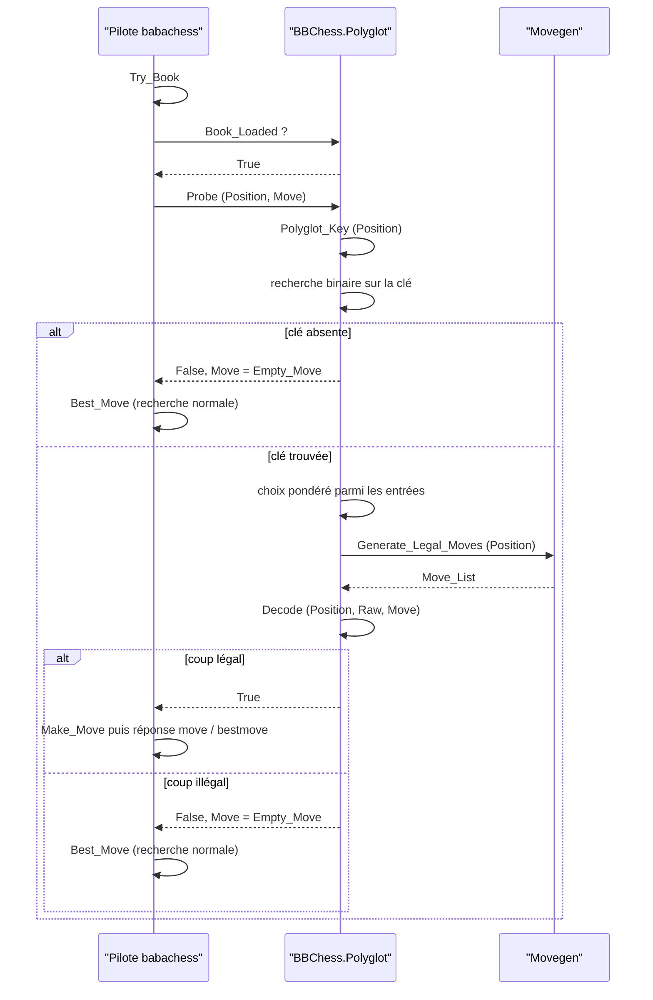
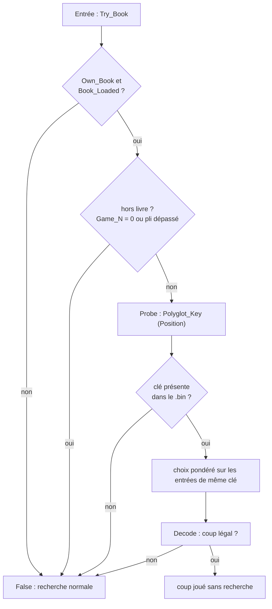

# Les ouvertures et le livre Polyglot

Un moteur sans livre s'engage seul sur des coups faibles : BB, livré à lui-même,
revenait sans cesse sur `1.Nc3`, une ouverture médiocre que l'évaluation statique
ne pénalise pas assez tôt. Le livre d'ouvertures corrige exactement ce biais. Il
ne réfléchit pas, il ne calcule rien : il joue un coup connu et rend la main.
C'est un composant latéral, au même titre que les tablebases Syzygy, consulté
**avant** que la recherche ne prenne le relais.

Le module s'appelle `BBChess.Polyglot` et vit dans `bbchess-polyglot.ads` /
`bbchess-polyglot.adb`. Il implémente le format standard **Polyglot `.bin`**,
compatible avec l'écosystème des moteurs et des GUIs, ce qui permet de réutiliser
des livres publics sans conversion.

## Le format Polyglot `.bin`

Un livre Polyglot est un simple fichier binaire, sans en-tête ni index
séparé. Il contient une suite d'entrées de **16 octets**, toutes au format
gros-boutiste (*big-endian*), et **triées par clé croissante** :

| Offset | Taille | Champ | Rôle |
|---|---|---|---|
| 0 | 8 | `key` | clé Zobrist Polyglot de la position |
| 8 | 2 | `move` | coup encodé (départ, arrivée, promotion) |
| 10 | 2 | `weight` | fréquence relative du coup |
| 12 | 2 | `learn` | réservé, ignore par BB |

`Open_Book` lit le fichier entrée par entrée et remplit un tableau en mémoire
(`Book_Array`). Le tri par clé est la propriété centrale : il autorise une
**recherche binaire** sur la clé, donc un sondage en `O(log n)`, sans avoir à
parcourir les centaines de milliers d'entrées d'un gros livre. Le commentaire
d'en-tête du paquet rappelle ce contrat : *16-byte entries, big-endian, sorted
by key*.

L'encodage du coup tient sur 16 bits, dans `Decode` :

- `from = (raw / 64) mod 64`, `to = raw mod 64`, avec la convention de cases
  `a1 = 0` jusqu'à `h8 = 63` ;
- `promo = (raw / 4096) mod 8`, où `1` = cavalier, `2` = fou, `3` = tour,
  `4` = dame, `0` = aucun.

Le champ `weight` sert de probabilité relative lors du choix : un coup joué
souvent dans la base pèse plus qu'un coup rare. BB ignore les octets `learn`.

## La clé de Zobrist Polyglot

Pour retrouver une position dans le livre, il ne suffit pas de calculer une clé
Zobrist quelconque : il faut **la même clé** que celle produite par les
générateurs de livres. Le format Polyglot fixe donc une convention précise, que
`Polyglot_Key` reproduit.

La fonction dispose d'une table embarquée `Polyglot_Random`, indexée de 0 à 780
(781 constantes). Le commentaire du corps précise que ces valeurs proviennent de
l'implémentation de référence et sont générées depuis `python-chess`. La
répartition des index est la suivante :

| Index | Contenu |
|---|---|
| 0 à 767 | pièces sur cases |
| 768 à 771 | droits de roque : blanc petit, blanc grand, noir petit, noir grand |
| 772 à 779 | prise en passant, une constante par colonne |
| 780 | trait |

**Encodage des pièces.** Pour une pièce de type `kind` (pion=0, cavalier=1, fou=2,
tour=3, dame=4, roi=5) et de couleur donnée, l'index dans la table est :

```
Idx = 64 * (2 * kind + Colour) + Square
```

où `Colour` vaut 1 pour les Blancs et 0 pour les Noirs : les index **pairs**
désignent les Noirs, les impairs les Blancs. C'est un piège historique du format,
relevé dans `DEVELOPMENT.md` ; l'inverser donne des clés fausses, ce que le test
croisé a immédiatement détecté. `Kind_Index` traduit `Pawn..King` vers `0..5`
avant de construire `Idx`.

**Prise en passant conditionnelle.** Polyglot n'ajoute la constante de colonne
que si un pion du camp au trait peut **réellement capturer** la case cible. Le
code teste le masque d'attaques (`South_1`/`West_1` pour les Blancs, `North_1`
pour les Noirs) contre les pions du trait, et n'applique le XOR que si
l'intersection est non vide. La légalité de la capture n'entre pas en jeu, seule
la possibilité géométrique compte : c'est la définition de référence. Une FEN
avec case `ep` mais sans pion attaquant produit donc une autre clé que la même
position sans case `ep`, ce que vérifie le test.

**Trait.** Un unique XOR final (`Polyglot_Random (780)`) n'est appliqué que
lorsque les Blancs sont au trait.

### Pourquoi cette clé diffère de `BBChess.Hash`

BB possède déjà un hachage Zobrist, `BBChess.Hash.Compute`, utilisé comme clé de
la table de transposition. Le livre ne peut pas s'en servir, et les deux clés
sont **volontairement indépendantes** :

| | `BBChess.Hash` | `Polyglot_Key` |
|---|---|---|
| Table | générée par LCG interne | 781 constantes figées du format |
| Pièces | 12 types × 64 cases | `64 * (2*kind + couleur) + case` |
| Trait | `Side_Key` | index 780 |
| Roque | `Castle_Key (couleur, côté)` | index 768 à 771 |
| En passant | clé par colonne, **inconditionnelle** | clé par colonne, **conditionnelle** |

La table de transposition n'a aucune contrainte de compatibilité externe : sa
graine et son agencement sont propres à BB. Le livre, lui, doit correspondre
octet pour octet à ce qu'ont produit les générateurs externes. C'est pour cette
raison que `Polyglot_Key` est une fonction séparée, avec sa propre table, plutôt
qu'une variante de `Compute`.

## Le déroulement d'un sondage

Le sondage ne vit pas dans `BBChess.Polyglot` seul : le pilote, `babachess.adb`,
décide d'abord **s'il faut consulter** le livre. La fonction `Try_Book` centralise
cette décision :

1. si `Own_Book` est faux, ou si `Book_Loaded` renvoie faux, on renonce ;
2. si la position courante est trop avancée, on renonce aussi. Le test
   `Game_N = 0 or else Game_N - 1 > Book_Max_Ply` limite le livre à
   `Book_Max_Ply = 16`, soit l'ouverture sur **16 demi-coups**. `Game_N` compte
   les clés de la partie enregistrées ; `Game_N - 1` est donc l'index du demi-coup
   courant. Au-delà, la recherche reprend la main ;
3. sinon `Probe` est appelé, et le coup n'est retenu que s'il est non vide.

`Probe` fait ensuite le travail :

- il calcule `Polyglot_Key (Position)` ;
- il cherche la borne inférieure de la clé par **recherche binaire** dans le
  tableau trié, puis vérifie que la clé à cette position est bien identique ;
- il balaie les entrées **contiguës de même clé** et en fait la somme des poids,
  chaque poids étant plancher à 1 (`Natural'Max (Book (I).Weight, 1)`), pour
  qu'une entrée de poids nul reste jouable ;
- il tire un nombre aléatoire dans cette somme et sélectionne l'entrée
  correspondante : c'est le **choix pondéré** ;
- il décode le coup via `Decode`, qui génère les coups légaux de la position et
  ne renvoie `True` que si le coup brut correspond à un coup **réellement
  légal**. Une entrée périmée, un coup impossible ou une promotion mal encodée
  renvoient `False`, et le livre est considéré comme muet sur cette position.

Le point important est que le sondage ne renvoie jamais de coup illégal : la
vérification de légalité est le dernier filtre, pas une simple politesse. Un
livre peut contenir des positions ou des coups qui ne correspondent plus à
l'état du jeu ; `Decode` s'en protège.

### Diagramme de séquence



### Diagramme de décision



## Configuration

Trois voies ouvrent un livre.

**Ligne de commande.** `--book <fichier>` appelle `Open_Book` sur le chemin
donné. BB applique ce choix avant le chargement par défaut, si bien qu'un
`--book` explicite l'emporte.

**Emplacements conventionnels.** Sans `--book`, `Load_Default_Book` essaie dans
l'ordre six candidats et retient le premier lisible :

1. `books/book.bin` (relatif au répertoire courant) ;
2. `books/book.bin` dans le dossier de l'exécutable ;
3. `books/book.bin` dans le dossier parent de l'exécutable ;
4. `~/.babachess/book.bin` ;
5. `book.bin` (répertoire courant) ;
6. `book.bin` dans le dossier de l'exécutable.

Si un livre est déjà chargé, `Load_Default_Book` ne fait rien : le `--book`
explicite n'est pas écrasé.

**UCI.** Deux options sont déclarées par la commande `uci` :

- `OwnBook` (type `check`, défaut `true`) : `setoption name OwnBook value false`
  coupe le livre sans le décharger, en agissant sur `Own_Book` ;
- `BookFile` (type `string`, défaut `books/book.bin`) : `setoption name BookFile
  value <chemin>` appelle directement `Open_Book`.

Cette dernière est pratique pour un GUI qui veut changer de livre en cours de
session sans relancer le moteur.

**Source des données.** `scripts/fetch_book.sh` télécharge un livre **CC0** et
l'installe sous `books/book.bin`. Le script exige `curl` et `zstd`, télécharge
l'archive `https://www.chesswob.org/jja/books/<nom>` puis la décompresse. Le
fichier par défaut est `lichess-201301-202303-gm2600.bin.zst` (parties de grands
maîtres) ; `lichess-201301-202303-2800+.bin.zst` et
`lichess-201301-202303-magnus.bin.zst` sont proposés en variantes. La licence CC0
est compatible avec la GPLv3 du projet. Le `.bin` n'est jamais commité : `.gitignore`
exclut `books/*`.

## Vérification du book

Le livre n'est pas chargé par `--selftest`, `--bench` ni `--eval-fens` : ces modes
retournent avant `Load_Default_Book`. BB vérifie donc la partie réellement
faillible en isolation, la **clé Zobrist**, et la confronte à des valeurs de
référence.

`BBChess.Self_Tests.Run` contient un bloc dédié qui charge une FEN, appelle
`Polyglot_Key` et compare le résultat à des constantes produites par
l'implémentation de référence (`python-chess`) :

| Position | Clé attendue |
|---|---|
| position initiale | `16#463B96181691FC9C#` |
| roques disponibles | `16#FDA239CC692A6053#` |
| en passant capturable | `16#5F442AAD040588EC#` |
| en passant non capturable | `16#5DCDC6EF271A91C9#` |
| milieu de partie | `16#FA541663E45EC608#` |

Ces cinq cas couvrent précisément les points délicats du format : le placement
initial, les quatre droits de roque, la distinction conditionnelle sur la prise
en passant, et une position quelconque de milieu de partie. Toute régression sur
la convention de couleur, sur les index de la table ou sur la condition
d'en passant fait échouer `--selftest`. Le test de la position « en passant non
capturable » est le plus révélateur : il ne diffère d'une position à l'autre que
par l'absence du pion capable de capturer, ce qui isole exactement la règle
conditionnelle.

La lecture du `.bin` et le sondage pondéré ne sont pas exercés par ce test, car
le livre n'est volontairement pas chargé dans les modes hors partie. La
validation du format repose sur la conformité binaire (16 octets, gros-boutiste)
et sur le test croisé de la clé, qui garantit que le moteur retrouve les bonnes
entrées dans un livre réel.

## Références

- PolyGlot : <https://www.chessprogramming.org/PolyGlot>
- Book (opening book) : <https://www.chessprogramming.org/Book>
- Zobrist Hashing : <https://www.chessprogramming.org/Zobrist_Hashing>
- Universal Chess Interface : <https://www.chessprogramming.org/UCI>
