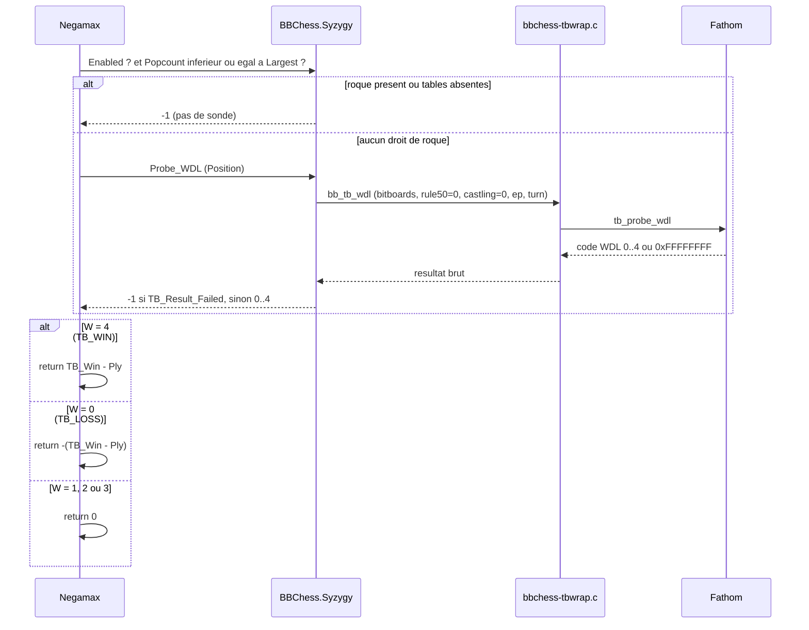
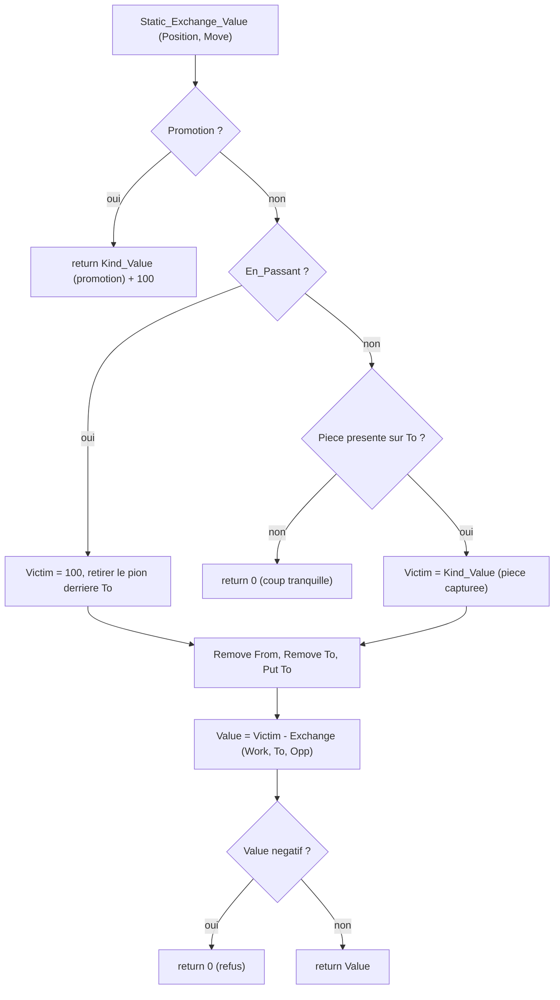
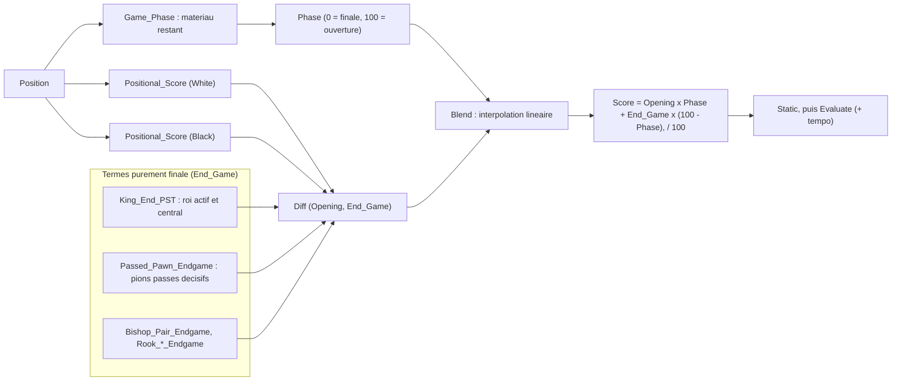

# Finales, tablebases et évaluation statique des échanges

Ce document décrit les composants d'BabaChess liés aux finales : les
**tablebases Syzygy** de `BBChess.Syzygy` (bindings sur la bibliothèque C
**Fathom**), l'**évaluation statique des échanges** (SEE) de `BBChess.See`, et
le **scaling d'évaluation par phase** de `BBChess.Eval`. Il explique les
principes retenus, pas chaque fonction. BB est le moteur bitboard (`src_bb/`) ;
MB (`src/`) ne sert ici que de référence.

## 1. Pourquoi des tablebases

En finale, les heuristiques montrent leurs limites : une finale KQvK gagnée peut
être manquée, une forteresse mal jugée, et la règle des 50 coups facilement
perdue de vue. Les **tablebases de fin de partie** donnent le résultat exact de
chaque position légale quand peu de pièces restent. BabaChess lit le format
**Syzygy** (fichiers `.rtbw` pour le résultat, `.rtbz` pour la distance), non
livrés avec le moteur : sans eux, l'intégration reste totalement inerte.

### 1.1 WDL : la seule métrique exploitée

Syzygy propose plusieurs mesures ; BB n'utilise que le **WDL** (*Win / Draw /
Loss*), le résultat théorique vu du trait, en ignorant la règle des 50 coups.
Fathom renvoie cinq codes, reflétés dans `bbchess-syzygy.ads` :
`TB_Result_Loss` (0), `TB_Result_Blessed_Loss` (1), `TB_Result_Draw` (2),
`TB_Result_Cursed_Win` (3), `TB_Result_Win` (4), plus `TB_Result_Failed`
(`16#FFFF_FFFF#`, sonde impossible). La distinction *blessed loss* / *cursed
win* vient de ce que le WDL suppose `rule50 = 0` ; BB traite ces deux cas comme
des nulles, approximation prudente et non jeu parfait.

## 2. Intégration dans la recherche

### 2.1 Le binding Ada

`BBChess.Syzygy` est une couche mince au-dessus du wrapper C
`src_bb/fathom/bbchess-tbwrap.c`, lui-même au-dessus de Fathom. Le wrapper
expose quatre symboles plats : `bb_tb_init`, `bb_tb_free`, `bb_tb_largest` et
`bb_tb_wdl` (la sonde, appelée avec un bitboard par type de pièce). L'API Ada
tient en cinq sous-programmes : `Init (Path, Ok)`, `Free`, `Largest`, `Enabled`
et `Probe_WDL (Position) return Integer`. `Init` renvoie `Ok = False` si aucune
table utilisable n'est trouvée ; dans ce cas `Largest = 0` et `Enabled = False`.
`Probe_WDL` convertit la `Position` en bitboards Fathom (`Color_Board`,
`Position.Pieces`, `Position.En_Passant`) et renvoie le code WDL 0..4 ou `-1`.

### 2.2 Où et comment la sonde est appelée

La sonde est au début de `Negamax` (`bbchess-search.adb`), après la détection
de répétition. Elle n'est tentée que si `BBChess.Syzygy.Enabled` et
`Popcount (Position.All_Occ) <= BBChess.Syzygy.Largest` (garde de matériau).
Le code WDL est ensuite converti : `4` (TB_WIN) devient
`BBChess.Syzygy.TB_Win - Ply` ; `0` (TB_LOSS) devient
`-(BBChess.Syzygy.TB_Win - Ply)` ; `1 | 2 | 3` (nulle / blessed / cursed)
devient `0` ; tout autre code laisse la recherche continuer normalement.

`TB_Win = 20_000`, `TB_Loss = -20_000` et `TB_Draw = 0` : ces bornes sont sous
le score de mat et au-dessus de toute évaluation normale. Le retrait du pli fait
préférer les gains proches et retarde les pertes. La boucle s'arrête dès que
`Abs (Best_Score)` atteint `TB_Win - 100`.

### 2.3 Diagramme de séquence d'une sonde

## 3. Limites explicites

Ces limites sont volontaires, documentées dans `DEVELOPMENT.md` § 14 et dans les
en-têtes du binding. À ne pas présenter comme des fonctionnalités.

- **WDL uniquement, pas de DTZ.** BB ne sonde jamais la distance à la
  conversion : `tb_probe_root` n'est pas appelé. Dans une finale gagnée, le
  moteur peut donc « tourner » sans progresser et laisser une nulle par la règle
  des 50 coups. Ajouter une sonde DTZ au root est identifié mais non fait.
- **Aucun droit de roque.** `Probe_WDL` refuse la position dès qu'un des quatre
  droits subsiste (`-1`) : les tables WDL ne les décrivent pas.
- **Halfmove ignoré.** `Probe_WDL` envoie toujours `Rule50 => 0` ; respecter
  exactement la règle des 50 coups demanderait le DTZ.
- **Inerte sans fichiers.** Sans `.rtbw` / `.rtbz`, `Init` échoue, `Largest`
  reste 0, `Enabled` est faux : la sonde n'est jamais atteinte, `--bench` inchangé.
- **Pas de jeu parfait au-delà du WDL.** `TB_Win - Ply` est une direction, pas
  une preuve de ligne optimale.

Test de fumée : avec les tables 3 pièces, un KQvK blanc renvoie 19999 dès la
profondeur 2.

## 4. Configuration

**Ligne de commande** (modes de jeu) : `./bin_bb/babachess --syzygy /chemin`,
et **UCI**, à chaud avant `go` :
`setoption name SyzygyPath value /chemin/vers/tables`. Dans les deux cas
la valeur est passée à `BBChess.Syzygy.Init`. Le chemin peut contenir plusieurs
répertoires séparés par le séparateur de la plateforme (`:` sous Unix, `;` sous
Windows). Un chemin invalide n'est pas fatal : `Ok` est faux et le moteur
continue sans tables. `--book` et `--syzygy` ne concernent que les modes de jeu.

## 5. SEE : évaluation statique des échanges

Le SEE de `BBChess.See` répond à une question étroite : *si j'entame la séquence
de captures sur une case, quel gain matériel net en résulte, en supposant que
les deux camps répondent par leur attaquant le moins cher ?* Le résultat est en
centipawns, du point de vue du camp au trait.

### 5.1 Principe

Fonction publique : `Static_Exchange_Value (Position, Move) return Score_Type`.
Briques privées : `Kind_Value` (pion 100, cavalier 320, fou 330, tour 500, dame
900, roi 10 000), `Attackers_Of`, `Weakest` (attaquant non cloué le moins cher)
et `Exchange` (minimax récursif).

Le modèle, partagé avec MB : les deux camps ne recapturent que sur la case de
destination, en choisissant leur attaquant le moins précieux ; les pièces
**clouées** (`Pin_Mask`) ne participent pas ; une recapture peut être **refusée**
(0), donc une suite perdante est abandonnée ; et le **roi n'est que le dernier
attaquant**.

Les rayons X (fou, tour, dame masqués par la pièce capturée) apparaissent
naturellement, car `Exchange` travaille sur une **copie mutable** de la position
et met l'occupation à jour à chaque étape (`Remove_Piece`, `Put_Piece`).
Promotions, coups tranquilles (valeur 0) et prises en passant (pion retiré
derrière la destination) sont traités à part.

### 5.2 Usages et vérification

SEE sert à deux endroits de `bbchess-search.adb`, pour **élaguer ou prouver**,
jamais comme évaluation. D'abord la **quiescence** : une capture dont le SEE est
négatif est ignorée (sauf promotion et évasion sous échec) ; le delta pruning
s'y ajoute. Ensuite **ProbCut** : un coup tactique n'est essayé que si son SEE
atteint `ProbCut_Margin`. Un ancien tri par SEE a été retiré (environ 13 % de
knps en moins, `DEVELOPMENT.md` § 9.3). Le self-test couvre : pièce non défendue
(+500), échange égal (0), cavalier contre pion défendu (-220), défenseur cloué
ignoré (+900), prise en passant (+100).

### 5.3 Diagramme de flux

## 6. Scaling d'évaluation : les termes de finale

`BBChess.Eval` n'a pas de terme « matériau restant » isolé, mais toute
l'évaluation positionnelle est **interpolée par phase** : c'est ce mécanisme qui
réserve aux finales leur traitement spécifique.

### 6.1 Phase de jeu et interpolation

Chaque terme est calculé deux fois, une valeur d'ouverture et une de finale,
portées par `Tapered_Score_Type` (`Opening`, `End_Game`). `Blend` interpole :
`(Score.Opening * Phase + Score.End_Game * (100 - Phase)) / 100`. `Phase` vient
de `Game_Phase`, calculée sur le matériau restant
(`4 × (cavaliers + fous) + 9 × tours + 16 × dames`, plafonnée à 100). Donc
`Phase = 100` en ouverture complète, `Phase = 0` en finale pure : quand les
pièces disparaissent, les valeurs de finale prennent le relais. Le calcul est
fait par couleur puis mis en miroir, ce qui préserve la symétrie (départ nulle,
position miroir opposée).

### 6.2 Termes à composante de finale

Les constantes suffixées `_Eg` sont des `rename` sur `Params`, donc accordables
au runtime par le tuner : `Bishop_Pair_Endgame`, `Rook_Open_File_Endgame`,
`Rook_Semi_Open_Endgame`, `Rook_Connected_Endgame`, `Rook_On_7th_Endgame`,
`Doubled_Pawn_Endgame`, `Isolated_Pawn_Endgame`, `Protected_Passed_Endgame` et
`Outside_Passed_Endgame`. Les **pions passés** ont deux tables ; le bonus grimpe
vers la promotion en finale (0, 12, 22, 38, 60, 90, 130 selon la rangée pour
`Passed_Pawn_Endgame`, contre 0, 5, 8, 12, 16, 22, 30 pour `Passed_Pawn_Opening`).

L'**activité du roi** est un cas à part : `King_End_PST` remplace le PST de
milieu. La correction `King_End_PST (K_Row, K_File) - PST (King, Color, King_Sq)`
pousse le roi au centre en finale ; portée uniquement par `End_Game`, elle
s'éteint quand la phase monte. La **sécurité du roi** est à l'inverse un terme
d'ouverture : elle n'est ajoutée que si `Phase >= King_Safety_Min_Phase` (20).

### 6.3 Diagramme du scaling

## 7. En résumé

Les tablebases donnent un **WDL exact** pour peu de pièces, via Fathom, mais
**sans DTZ ni roque** et **inertes sans fichiers**. Le **SEE** estime le gain
d'une séquence et sert à élaguer (quiescence, ProbCut), pas à évaluer.
L'**évaluation** interpole ouverture et finale par phase.

## Références

- Syzygy Bases : <https://www.chessprogramming.org/Syzygy_Bases>
- Endgame Tablebases : <https://www.chessprogramming.org/Endgame_Tablebases>
- Static Exchange Evaluation :
  <https://www.chessprogramming.org/Static_Exchange_Evaluation>
- Fathom (Jon Dart), sondage Syzygy (MIT) :
  <https://github.com/jdart1/Fathom>
- Journal interne : `DEVELOPMENT.md` § 14 (tablebases) et § 5.2 (*tapered*).
- Sources : `src_bb/bbchess-syzygy.*`, `src_bb/bbchess-see.*`,
  `src_bb/bbchess-eval.adb`, `src_bb/fathom/`.
