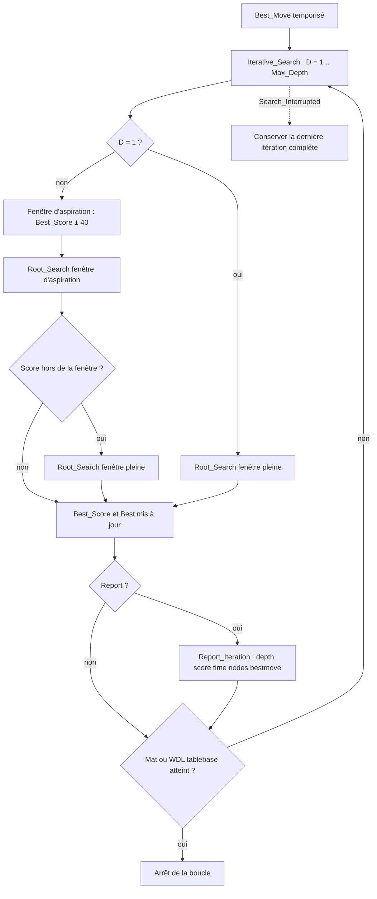
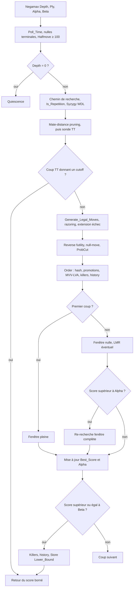

# Recherche BabaChess

Ce document décrit les algorithmes de recherche du moteur **BabaChess** (unité
`BBChess.Search`, fichiers `src_bb/bbchess-search.ads` et `bbchess-search.adb`).
Il explique les principes et les choix de conception, pas le code ligne à ligne,
et garde la trace des techniques **gardées**, **retirées** et **à l'essai**, en
cohérence avec `DEVELOPMENT.md`.

La recherche est un **negamax alpha-bêta** avec approfondissement itératif,
table de transposition, PVS, quiescence et un ensemble d'élagages modernes. Les
scores sont en centipions, du point de vue du trait (`Score_Type`, `Infinity`,
`Mate_Score` dans `BBChess.Eval`).

`bbchess-search.ads` expose `Best_Move (Position, Depth)` (profondeur fixe, pour
les bancs), `Best_Move (Position, Max_Depth, Time_Alloc)` (temporisée, point
d'entrée du multi-thread) et `Reset_Search` (vide table et heuristiques entre
deux parties, sur `new` ou `ucinewgame`). `Set_Game_History` transmet les clés de
la partie pour la répétition, `Set_Post` active la sortie XBoard, `Set_Threads`
fixe le nombre de threads, et `Nodes_Searched` / `Reset_Nodes` alimentent le banc.

## Approfondissement itératif et fenêtres d'aspiration

`Iterative_Search` boucle de la profondeur 1 jusqu'à `Max_Depth`. À chaque
itération, `Root_Search` cherche les coups racine et renvoie le meilleur ainsi
que son score, qui sert d'ancre à l'itération suivante.

- **Itération 1** : fenêtre pleine (`Alpha = -Infinity`, `Beta = Infinity`),
  faute de score précédent.
- **Itérations suivantes** : fenêtre d'aspiration de `Aspiration_Window = 40`
  centipions autour du score précédent. Si le score sort de la fenêtre (fail low
  ou fail high), la profondeur est **re-cherchée en fenêtre pleine** : correct et
  peu coûteux tant que la fenêtre tient, ce qui est presque toujours le cas.
- L'itération s'arrête plus tôt en cas de mat trouvé
  (`Abs (Best_Score) >= Mate_Score - 200`) ou de résultat de tablebase
  (`Abs (Best_Score) >= BBChess.Syzygy.TB_Win - 100`).

Le principal intérêt de l'approfondissement itératif n'est pas le score, mais
**l'ordonnancement** : le meilleur coup de la profondeur `D` est cherché en
premier à `D+1`, ce qui produit tôt des coupures bêta et réduit l'arbre.

La recherche est **interruptible** : `Poll_Time` vérifie l'échéance toutes les
`Check_Interval = 1024` visites et lève `Search_Interrupted`. `Iterative_Search`
conserve alors le coup de la **dernière itération complète** ; si aucune n'a fini,
`Best_Move` retombe sur `Quick_Move` (un coup légal sans recherche, tactiques
d'abord).

## Alpha-bêta et PVS

`Negamax` est le cœur de la recherche. La fenêtre `[Alpha, Beta]` borne ce que
le trait peut espérer : un score `>= Beta` est un **fail high** (le nœud est trop
bon pour être vrai), un score `<= Alpha` un **fail low**. La recherche **PVS**
(Principal Variation Search) est appliquée au root comme à chaque nœud :

1. Le **premier coup** (le mieux ordonné) est cherché en fenêtre pleine
   `[-Beta, -Alpha]`.
2. Les coups suivants sont cherchés en **fenêtre nulle** `[-Alpha - 1, -Alpha]`,
   plus sévère donc moins chère. Si un coup dépasse `Alpha`, il est
   **re-recherché en fenêtre complète**.

Ce mécanisme n'est correct que si l'ordonnancement place le bon coup en tête :
c'est là que l'approfondissement itératif et l'ordre des coups se rejoignent. Le
root (`Root_Search`) applique la même stratégie, avec `Prev_Best` en tête.

Deux garde-fous protègent les scores : l'**élagage de distance de mat** (score
borné par `-Mate_Score + Ply` et `Mate_Score - Ply - 1`) et la **normalisation
des scores de mat dans la TT** (`Adjust_Score` à la lecture, `Store` à
l'écriture, décalage par le ply).

## Table de transposition

La table mémorise un résultat par position déjà vue et est indexée par la **clé
Zobrist** (`BBChess.Hash`).

### Zobrist

`BBChess.Hash` construit une clé 64 bits par XOR de constantes tirées d'un
générateur congruentiel déterministe (`Next_Random`, graine fixe) :
`Piece_Key_Val (Piece, Square)`, `Side_Key_Val` pour le trait noir,
`Castle_Key_Val (Color, Castle_Side)` et `Ep_Key_Val (File)` pour la colonne de
prise en passant. `Hash.Compute` recalcule la clé complète ; pendant la
recherche, elle est maintenue **par mise à jour incrémentale** dans `Make_Move`,
ce qui reproduit exactement `Compute` (vérifié par le self-test).
`Set_Keys_Enabled` active ce calcul, désactivé par défaut pour que le perft ne
paie pas le hachage.

### Entrée et buckets

La table `Transposition_Table` fait `TT_Size = 1_048_576` entrées. Chaque
`TT_Entry` contient :

| Champ      | Rôle |
|------------|------|
| `Hash_Key` | clé Zobrist complète, pour confirmer l'identité de la position |
| `Depth`    | profondeur de recherche restante ; `-1` signifie « vide » |
| `Bound`    | `Exact`, `Lower_Bound` ou `Upper_Bound` |
| `Score`    | score normalisé (mat décalé par le ply) |
| `Move`     | meilleur coup, encodé en 32 bits (`Pack_Move`) |
| `Age`      | génération de recherche, pour le remplacement |

Les positions sont rangées dans des **buckets de deux voies** : `TT_Bucket`
calcule un index pair à partir de la clé (`Key and (TT_Mask - 1)`), et la sonde
regarde l'index pair puis l'impair. `Store` choisit l'emplacement ainsi : clé
identique d'abord, puis emplacement vide, puis entrée trop ancienne
(`Age < TT_Generation`), puis l'entrée la moins profonde. L'écriture n'a lieu que
si la nouvelle entrée est au moins aussi profonde, si la clé correspond, ou si
l'ancienne est périmée : remplacement **depth-preferred** avec aging.
`TT_Generation` est incrémentée à chaque `Best_Move`, donc une entrée d'une
recherche précédente cède la place avant une entrée fraîche.

La table **n'est pas vidée entre les coups** (« Phase A »), seulement sur
`Reset_Search` : le moteur réutilise les nœuds vus plus tôt dans la partie.
`Clear_Transposition_Table` vide entrée par entrée, et non par agrégat, pour ne
pas construire la table entière sur la pile. Le cutoff n'est appliqué que si
`E.Depth >= Depth` ; le coup TT est extrait dans `Hash_Move` même quand la
profondeur ne suffit pas, car il sert alors à l'ordonnancement.

## Ordonnancement des coups

`Order` attribue un score d'ordonnancement à chaque coup ; la boucle de `Negamax`
trie la liste par sélection. Du plus prioritaire au moins prioritaire :

1. **Coup de la table de transposition** (`Hash_Move`, score `100_000_000`).
2. **Promotions** (`50_000_000 + valeur de la pièce promue`).
3. **Captures MVV-LVA** (`2_000_000 + 16 × victime - attaquant`) : *Most Valuable
   Victim, Least Valuable Attacker*, la pièce la plus chère prise par la moins
   chère ; `Captured_Kind` gère la prise en passant.
4. **Killers** (`1_000_000` et `900_000`) : les deux coups tranquilles ayant
   provoqué une coupure bêta au même ply ailleurs, dans `Ctx.Killers`.
5. **History** : les autres coups tranquilles sont ordonnés par
   `Ctx.History (couleur, From, To)`. `History_Bonus` vaut `depth²` plafonné à
   `1024` et `Bump_History` le borne à `History_Max = 16_384` ; un coup qui
   n'améliore pas `Alpha` reçoit un **malus**, pour apprendre aussi les mauvais
   coups.

En quiescence, l'ordonnancement est réduit : coups tactiques en tête, triés par
valeur de la victime (MVV), sans killers ni history.

## Quiescence

`Quiescence` prolonge la recherche au-delà de l'horizon, car on ne peut pas
évaluer statiquement une position au milieu d'une série d'échanges. Sa logique :

- **Stand pat** : hors échec, on évalue la position (`Evaluate`) ; si la valeur
  atteint `Beta`, on coupe, si elle dépasse `Alpha`, on l'adopte.
- **En échec**, pas de stand pat : toutes les évasions sont générées et
  cherchées, coups tranquilles compris. Hors échec, seuls les **coups tactiques**
  sont générés (`Generate_Legal_Tactical_Moves`).
- **Mat et pat** détectés à l'horizon : sans coup disponible en échec, le nœud
  renvoie `-(Mate_Score - Ply)`.
- **Élagage de delta** : une capture dont la victime plus `Delta_Margin = 200`
  n'atteint pas `Alpha` n'est pas cherchée.
- **Élagage SEE** : une capture dont `Static_Exchange_Value` est négative est
  perdante et sautée, sauf les promotions et les évasions sous échec.

L'évaluation statique des échanges vit dans `BBChess.See` : `Attackers_Of` liste
les attaquants d'une case (les x-ray apparaissent grâce à l'occupation mise à
jour), `Weakest` choisit le moins cher **en excluant les pièces clouées**
(`Pin_Mask`), et `Exchange` déroule récursivement la séquence. Un camp peut
**renoncer** (rester à 0), le roi n'est admis qu'en dernier attaquant, et
`Static_Exchange_Value` gère promotions et prise en passant.

## Élagage et réductions

Ces techniques coupent des branches jugées inutiles. Toutes vérifient d'abord
qu'on n'est ni en échec ni dans une position de mat.

- **Null-move pruning** : `Depth >= 3`, hors échec, et seulement si le camp a
  une pièce autre qu'un pion (`Has_Non_Pawn`), pour éviter le zugzwang des
  finales de pions. Le trait est passé (`Position.Side` inversé, en passant
  annulé, clé mise à jour) et le nœud est cherché avec `Null_Reduction = 2` plis
  en moins ; un score `>= Beta` coupe.
- **Reverse futility** : à `Depth = 1`, si l'évaluation statique moins
  `Futility_Margin = 180` atteint déjà `Beta`, le nœud est renvoyé tel quel.
- **Futility pruning** : à `Depth <= 2`, un coup tranquille dont l'évaluation
  statique plus `Futility_Base = 120` fois la profondeur ne peut pas atteindre
  `Alpha` est sauté.
- **Razoring** : à `Depth <= 2`, si l'évaluation statique est très en dessous
  d'`Alpha` (`Razor_Margin = 300` fois la profondeur), le nœud est **vérifié par
  une quiescence**, renvoyée si elle ne remonte pas jusqu'à `Alpha`.
- **Late move pruning (LMP)** : à `Depth <= 3`, les coups tranquilles au-delà de
  l'index `4 + Depth²` ne sont pas cherchés ; ordonnés en dernier, ils
  n'améliorent presque jamais la fenêtre.
- **Late move reduction (LMR)** : à `Depth >= 3`, dès le 4ᵉ coup et hors échec,
  un coup tranquille reçoit la réduction de `LMR_Table` (`Compute_LMR`,
  `R = 0.75 + ln (depth) × ln (move) / 2.25`). Un fail-high de la recherche
  réduite est **toujours re-vérifié à profondeur pleine** (correction de la
  Phase 0).
- **ProbCut** : voir la section « en cours d'expérimentation ».

## Extension en échec

Un nœud où le trait est **en échec** cherche ses évasions **un ply plus profond**
(`Child_Depth := Depth`), car elles sont forcées et une séquence d'échecs ne doit
pas être tronquée par l'horizon. Le mécanisme est borné par
`Ply <= Max_Ply - 4`. Une variante plus agressive, qui étendait **tout coup
donnant échec**, a été essayée puis retirée (voir plus bas).

## Nulles et impasses

Avant tout cutoff de table, `Negamax` traite les nulles : **`Halfmove >= 100`**
(règle des 50 coups), **`Insufficient_Material`** (roi seul contre roi seul, roi
plus une pièce mineure contre roi, fous de même couleur, avec la garde
`Popcount (All_Occ) <= 4` qui maintient la détection hors du chemin chaud), et
**`Is_Repetition`** : une position déjà sur la ligne courante (`Ctx.Search_Path`)
vaut nulle dès la deuxième occurrence, tandis que l'historique de partie
(`Ctx.Game_Keys`, `Max_Game_Keys = 512`) exige **trois** occurrences. La
recherche ne remonte que depuis le dernier coup irréversible (`Position.Halfmove`).

## Threading : Lazy SMP

`Best_Move` temporisé supporte jusqu'à `Max_Threads = 16` threads
(`Set_Threads`, option `--threads` ou UCI `Threads`), selon un **Lazy SMP** :

- La **table de transposition est partagée** : un thread exploite les nœuds
  trouvés par les autres.
- Chaque thread a son propre `Search_Context` (killers, history, chemin de
  répétition, compteur de nœuds, échéance), donc les heuristiques ne se marchent
  pas dessus.
- Les threads sont des **tâches Ada** (`task type Searcher`) ; le thread primaire
  (`Id = 1`) rapporte les itérations, les autres remplissent la TT.
- L'arrêt passe par `Stop_Search`, un booléen `pragma Atomic` positionné par le
  thread primaire et testé par `Poll_Time`. Une barrière protégée `Completion`
  (`Done.Wait_All`) attend la fin de tous les threads.
- `Abort_Request` (`Request_Stop` / `Clear_Stop`, Phase 5) est une **seconde**
  demande d'arrêt, externe (UCI `stop`/`quit`) : elle est également testée par
  `Poll_Time` et n'est effacée que par `Clear_Stop`, au démarrage d'une
  recherche. Le `go nodes N` arme le champ `Node_Limit` du contexte de recherche,
  aussi testé par `Poll_Time`, ce qui borne le dépassement à un intervalle de
  sondage (`Check_Interval = 1024` nœuds). La sortie XBoard "post" et les lignes
  UCI (`readyok`, `bestmove`) passent par le verrou protégé `Console`
  (`Locked_Put_Line`), `Ada.Text_IO` n'étant pas sûr en concurrence de tâches.
- Le résultat retenu est celui du thread ayant atteint la **plus grande
  profondeur**, départagé par le score ; à défaut, `Quick_Move`.

Les écritures dans la TT ne sont pas verrouillées. Pour que les courses restent
bénignes, `Store` écrit **le payload champ par champ, clé en dernier**, et la
sonde **teste la clé avant de copier** l'entrée : un emplacement n'est utilisé
que si la clé nouvelle est visible, donc avec un payload déjà consistant. Une
clé ancienne sur un emplacement à moitié écrit échoue simplement au test de clé.
Deux threads peuvent encore écrire des entrées valides dans le même emplacement
(la dernière clé gagne) ou remplacer un emplacement entre le test et la copie,
ce qui ne donne qu'un nœud key-consistent, éventuellement moins profond.

## Techniques gardées, retirées et à l'essai

### Implémenté et validé

- **Iterative deepening, PVS, aspiration windows** (itération 1 en fenêtre
  pleine puis ± 40 cp), table à deux voies avec aging, ordonnancement hash /
  promotions / MVV-LVA / killers / history.
- **Null-move pruning** (`Null_Reduction = 2`) et **reverse futility** à
  profondeur 1.
- **Phase 0 (correction)** : re-recherche pleine de tout fail-high LMR, history
  quadratique avec malus, nulles terminales, mate-distance pruning. Bilan neutre
  en A/B (10-9-21, environ ± 9 Elo) mais supprime des erreurs réelles : conservée
  comme prérequis.
- **Phase 1 (élagage)** : LMR log, LMP, futility pruning, razoring, delta
  pruning en quiescence. Arbre divisé par environ 11 à profondeur 9 (7,6 M vers
  0,67 M nœuds), environ **+61 Elo** en self-play et **+140 Elo** contre GNU
  Chess (de 0-8-2 à 1-13-6).
- **SEE** dans la quiescence, promotion d'abord, évasions toujours cherchées.
- **Extension en échec** des évasions, bornée par le ply.
- **Lazy SMP** : TT partagée, contexte par thread. À 1 s+0,1 s : 1 thread 2-9-9,
  4 threads environ **+127 Elo**.
- **Sonde WDL Syzygy** dans `Negamax` (gain, perte, nulle).

### Implémenté et retiré (neutre ou négatif)

- **Singular extensions** : implémentées puis **retirées** (commit `f17f217`).
  Le probe cherchait la même position à `(Depth - 1) / 2` avec le coup TT exclu ;
  une SPRT de 300 parties a conclu **neutre** (`+4,6 ± 31,3` Elo, LOS 38,6 %) pour
  un coût en nœuds (`--bench 11` : 2,62 M vers 2,95 M, +12,5 %). Le paramètre
  `Excluded` et tout le câblage ont été supprimés avec le probe.
- **Phase 2 « ordonnancement »** : history persistante entre les coups,
  **countermove**, et tri **SEE** des captures. Régression nette contre GNU
  Chess (Phase 1 : 8/30, Phase 2 : 2/30) et tri SEE à environ 13 % de knps en
  moins. **Tout le lot a été annulé.**
- **Extension en échec de tout coup donnant échec** : arbre multiplié par 2,8,
  sans corriger le coup visé. **Revertée.**
- **Extension « recapture »** (capture sur la case du coup précédent) : arbre
  multiplié par 3,1, sans effet sur le coup visé. **Revertée.**
- **IID** (recherche itérative interne) : +5 % de nœuds, SPRT de 300 parties
  **neutre** (`+6,9 ± 32,5` Elo). **Non retenue.**
- **Échecs tranquilles en quiescence** : corrigeaient une position diagnostique
  mais coûtaient **+49 % de temps** à nœuds quasi égaux. **Écartés.**

### En cours d'expérimentation

- **ProbCut** : présent dans l'arbre de travail (non commité). À
  `Depth >= ProbCut_Min_Depth = 5`, hors échec, on cherche un petit nombre de
  captures prometteuses (`ProbCut_Max_Moves = 2`, celles dont
  `Static_Exchange_Value >= ProbCut_Margin = 200`) avec une fenêtre bêta
  **relevée** (`B + ProbCut_Margin`) et une profondeur réduite
  (`Depth - ProbCut_Depth = 4`). Si ce probe dépasse la borne relevée, le nœud
  est considéré comme réfuté et le score est renvoyé sans payer la recherche
  pleine profondeur. Technique standard (voir les références), mais **pas encore
  validée** : elle doit passer `--selftest`, un `--bench` stable, puis une
  campagne SPRT de plusieurs centaines de parties, comme l'ont été les singular
  extensions.

## Références

- [Alpha-Beta](https://www.chessprogramming.org/Alpha-Beta)
- [Principal Variation Search](https://www.chessprogramming.org/Principal_Variation_Search)
- [Iterative Deepening](https://www.chessprogramming.org/Iterative_Deepening)
- [Aspiration Windows](https://www.chessprogramming.org/Aspiration_Windows)
- [Transposition Table](https://www.chessprogramming.org/Transposition_Table)
- [Zobrist Hashing](https://www.chessprogramming.org/Zobrist_Hashing)
- [Move Ordering](https://www.chessprogramming.org/Move_Ordering)
- [Killer Heuristic](https://www.chessprogramming.org/Killer_Heuristic)
- [History Heuristic](https://www.chessprogramming.org/History_Heuristic)
- [Late Move Reductions](https://www.chessprogramming.org/Late_Move_Reductions)
- [Null Move Pruning](https://www.chessprogramming.org/Null_Move_Pruning)
- [Quiescence Search](https://www.chessprogramming.org/Quiescence_Search)
- [Static Exchange Evaluation](https://www.chessprogramming.org/Static_Exchange_Evaluation)
- [ProbCut](https://www.chessprogramming.org/ProbCut)
- [Lazy SMP](https://www.chessprogramming.org/Lazy_SMP)
